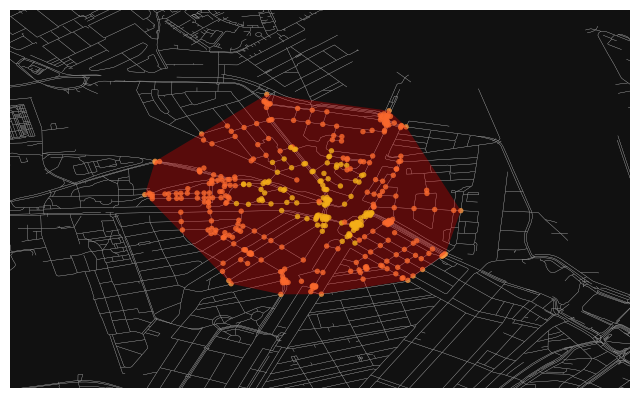

[Back](./)
## Assignment 4: Transport
Below you will find the answers to the questions and our Python code used in the fourth assignment. All code for running it yourself is to be found in our github.

### Question 1: Find the centre of the nodes of the swimming route.

```python
import osmnx as ox
import networkx as nx
import math
import warnings

#Hides annoying warnings :)
warnings.filterwarnings('ignore')

#Find coordinates of Artis (start point)
location_ARTIS = ox.geocode("Entrepotdok 86, Amsterdam, Netherlands")

#Find coordinates of Westerpark (end point)
location_Westerpark = ox.geocode("Westerpark 1, Amsterdam, Netherlands")
print('The coordinates of the start point are', location_ARTIS, 'and of the end point:', location_Westerpark)

#This gets all the canal data from Amsterdam
canals = ox.graph_from_place('Amsterdam, Netherlands', retain_all=False, truncate_by_edge=False,
                        simplify=True, custom_filter='["waterway"~"canal"]')

#Find the nearest nodes nearest node
nodes_ARTIS = ox.distance.nearest_nodes(canals, location_ARTIS[1], location_ARTIS[0], return_dist=True)
nodes_Westerpark = ox.distance.nearest_nodes(canals, location_Westerpark[1], location_Westerpark[0], return_dist=True)

#Check if nodes exist
if nodes_ARTIS[0] in canals.nodes:
    print("Node found.")
if nodes_Westerpark[0] in canals.nodes:
    print("Node found.")

#This loop ensures a route is found between the start and end point of at least 5000m
L = 5000 #The route is 5000m long
path = ox.k_shortest_paths(canals, nodes_ARTIS[0], nodes_Westerpark[0], 1000, 'length')
for i, path in enumerate(path):
    length = sum(ox.utils_graph.get_route_edge_attributes(canals, path, 'length'))
    if length >= L:
        break
i, length, path

#These are the nodes of the path
print('The nodes of the whole path are', path)

#Since the path is an odd list, this calculates the middle node
middle_node = math.ceil(len(path) / 2)
print('The', middle_node, 'th node is the middle one with the corresponding OSMid being:', path[middle_node])

#Zoom in with middle point as center for bbox
node_middle = canals.nodes(data=True)[path[middle_node]]
bbox = ox.utils_geo.bbox_from_point((node_middle['y'], node_middle['x']), dist=2200)

#Plot graph of canals
pt = ox.graph_to_gdfs(canals, edges=False).unary_union.centroid
fig, ax = ox.plot_graph_route(canals, path, bbox=bbox, show=False, close=False)

#Plots the middle node of route
ax.scatter(canals.nodes[path[12]]['x'], canals.nodes[path[12]]['y'], c='red')

#This calculates the length of the path
lengths = ox.utils_graph.get_route_edge_attributes(canals, path, 'length')
path_length = sum(lengths)
print('The length of the path in meters is', path_length)
```

    The coordinates of the start point are (52.3671947, 4.919245) and of the end point: (52.3862001, 4.8812058)
    Node found.
    Node found.
    The nodes of the whole path are [3781170134, 323929882, 331854233, 8010136114, 252142901, 324827507, 305155548, 305155547, 305156166, 8003741421, 9407684484, 324128505, 324126395, 1195429031, 730950175, 277138134, 178261171, 60740843, 117738457, 154546029, 305084168, 305082709, 305081090]
    The 12 th node is the middle one with the corresponding OSMid being: 324126395
    The length of the path in meters is 5004.24
    
We plotted the canals in Amsterdam and used some code to create a route of at least 5km between a set start and finish point. Also the centre of the nodes of the route was found and is indicated by a red dot in the image below.


    

    

### Question 2: Use the centre to find a suitable spot for the Event Headquarters.


The centre is located very close to Amsterdam central station, which is a very busy area. We decided that the most suitable spot is along the Oosterdokskade as shown in the map above.

### Question 3: Calculate the centrality of the start, finish, and centre node of the route. Which centrality calculation makes the most sense?

We start by plotting a map of all the pedestrian roads in Amsterdam, zoomed in a bit.


```python
#This gets all the walkway data from Amsterdam
walk = ox.graph_from_place('Amsterdam, Netherlands', network_type='walk')

#Plot graph of walkways
bbox = ox.utils_geo.bbox_from_point((node_middle['y'], node_middle['x']), dist=1200)
fig, ax = ox.plot_graph(walk, bbox=bbox, show=False, close=False)
#ax.scatter(canals.nodes[node_middle['x']], canals.nodes[node_middle['y']], c='red')
ax.scatter(52.3768364, 4.9027817, c='red')
```


    

    


```python
#We convert the coordinates of the start, middle and end point to nodes within the walk network
nodes_ARTIS_walk = ox.distance.nearest_nodes(walk, location_ARTIS[1], location_ARTIS[0], return_dist=True)
nodes_Westerpark_walk = ox.distance.nearest_nodes(walk, location_Westerpark[1], location_Westerpark[0], return_dist=True)
nodes_middle_walk = ox.distance.nearest_nodes(walk, node_middle['y'], node_middle['x'], return_dist=True)
```


```python
#Use networkx to calculate the centrality
start_centrality = nx.closeness_centrality(walk, u=nodes_ARTIS_walk[0])
middle_centrality = nx.closeness_centrality(walk, u=nodes_middle_walk[0])
end_centrality = nx.closeness_centrality(walk, u=nodes_Westerpark_walk[0])

#Then we can print the centrality values
print('The centrality of the startpoint is', start_centrality)
print('The centrality of the middlepoint is', middle_centrality)
print('The centrality of the endpoint is', end_centrality)
```

    The centrality of the startpoint is 0.011533845360739333
    The centrality of the middlpoint is 0.008907405335857353
    The centrality of the endpoint is 0.012051479739535237
    
We chose to use the closeness centrality method to calculate the centrality of the start, middle and finish point. 

### Question 4: Find the closest bus and tram stops at the start and finish of the swimming route. How many people can be transported within an hour?


```python
import geopandas as gpd
import matplotlib.pyplot as plt
from descartes import PolygonPatch
from shapely.geometry import Point, LineString, Polygon
%matplotlib inline
ox.config(log_console=True)
ox.__version__

#set the variables to be used to find the area reachable in a certain amount of minutes by foot

trip_times = [5, 10, 15, 20, 25] #in minutes
travel_speed = 4.5 #walking speed in km/hour
```


```python
#convert time to distance

meters_per_minute = travel_speed * 1000 / 60 #km per hour to m per minute
for u, v, k, data in walk.edges(data=True, keys=True):
    data['time'] = data['length'] / meters_per_minute
```


```python
#set color for isochrones
iso_colors = ox.plot.get_colors(n=len(trip_times), cmap='plasma', start=0, return_hex=True)
```


```python
#assign colors to nodes

node_colors = {}
for trip_time, color in zip(sorted(trip_times, reverse=True), iso_colors):
    subgraph = nx.ego_graph(walk, nodes_Westerpark_walk[0], radius=trip_time, distance='time')
    for node in subgraph.nodes():
        node_colors[node] = color
nc = [node_colors[node] if node in node_colors else 'none' for node in walk.nodes()]
ns = [15 if node in node_colors else 0 for node in walk.nodes()]

bbox = ox.utils_geo.bbox_from_point((location_Westerpark), dist=1200)


fig, ax = ox.plot_graph(walk, show=False, bbox = bbox, close=False, node_color=nc, node_size=ns, node_alpha=0.8,
                        edge_linewidth=0.2, edge_color='#999999')
```


    

    


```python
# Define trip times to be plotted
plot_trip_times = [5, 10]

# Create a dictionary to store node colors
node_colors = {}

# Assign colors to nodes for 5 and 10 minutes walking (the selected trip times)
for trip_time, color in zip(sorted(trip_times, reverse=True), iso_colors):
    if trip_time in plot_trip_times:
        subgraph = nx.ego_graph(walk, nodes_Westerpark_walk[0], radius=trip_time, distance='time')
        for node in subgraph.nodes():
            node_colors[node] = color

# Create a list of node colors and sizes
nc = [node_colors.get(node, 'none') for node in walk.nodes()]
ns = [15 if node in node_colors else 0 for node in walk.nodes()]

# Define the bounding box based on the location
bbox = ox.utils_geo.bbox_from_point(location_Westerpark, dist=1200)

# Plot the graph of nodes reachable in 10 minutes
fig, ax = ox.plot_graph(walk, show=True, bbox=bbox, close=True, node_color=nc, node_size=ns, node_alpha=0.8,
                        edge_linewidth=0.2, edge_color='#999999')
```


    

    


```python
from shapely.geometry import MultiPoint

# Create a list of coordinates for the selected nodes
node_coordinates = [(data['x'], data['y']) for node, data in walk.nodes(data=True) if node in node_colors]

# Create a MultiPoint object and a convex hull
multi_point = MultiPoint(node_coordinates)
convex_hull = multi_point.convex_hull

# Plot the graph and the convex hull
fig, ax = ox.plot_graph(walk, show=False, bbox=bbox, close=False, node_color=nc, node_size=ns, node_alpha=0.8,
                        edge_linewidth=0.2, edge_color='#999999')
gpd.GeoSeries([convex_hull]).plot(ax=ax, color='red', alpha=0.3)
plt.show()
```


    

    


```python
# Create a GeoDataFrame with the convex hull polygon as an extent
extent_gdf = gpd.GeoDataFrame(geometry=[convex_hull])
```


```python
from shapely.ops import nearest_points

# Open OSM shapefile
gdf = gpd.read_file('data\gis_osm_transport_free_1.shp')

# Select tram stops
gdf_tram_stops = gdf.loc[gdf['fclass'] == 'tram_stop']
gdf_bus_stops = gdf.loc[gdf['fclass'] == 'bus_stop']

# Start and finish point
target_point = Point(location_ARTIS[1], location_ARTIS[0])  
target_point_finish = Point(location_Westerpark[1], location_Westerpark[0])

#Set basics
nearest_point = None
min_distance = float('inf')

#Function to find the nearest stop from a certain target point
def find_nearest_stop(gdf_stops, target_point):
    min_distance = float('inf')
    nearest_stop = None

    for index, row in gdf_stops.iterrows():
        distance = row['geometry'].distance(target_point)
        if distance < min_distance:
            min_distance = distance
            nearest_stop = row
    return nearest_stop

# Find the nearest stops from the start point
nearest_tramfromstart = find_nearest_stop(gdf_tram_stops, target_point)
nearest_busfromstart = find_nearest_stop(gdf_bus_stops, target_point)

# Find the nearest stops from the finish point
nearest_busfromfinish = find_nearest_stop(gdf_bus_stops, target_point_finish)
nearest_tramfromfinish = find_nearest_stop(gdf_tram_stops, target_point_finish)

print('\nNearest tramstop from start:\n', nearest_tramfromstart)
print('\nNearest bus stop from start:\n', nearest_busfromstart)
print('\nNearest bus stop from finish:\n', nearest_busfromfinish)
print('\nNearest tramstop from finish:\n', nearest_tramfromfinish)

```

    
    Nearest tramstop from start:
     osm_id                         434430962
    code                                5603
    fclass                         tram_stop
    name                      Alexanderplein
    geometry    POINT (4.9192366 52.3638735)
    Name: 222, dtype: object
    
    Nearest bus stop from start:
     osm_id                      4623486305
    code                              5621
    fclass                        bus_stop
    name                Wittenburgergracht
    geometry    POINT (4.91969 52.3694102)
    Name: 5262, dtype: object
    
    Nearest bus stop from finish:
     osm_id                        4623486159
    code                                5621
    fclass                          bus_stop
    name                         Nassauplein
    geometry    POINT (4.8815551 52.3853766)
    Name: 5255, dtype: object
    
    Nearest tramstop from finish:
     osm_id                         46462976
    code                               5603
    fclass                        tram_stop
    name                    Zoutkeetsgracht
    geometry    POINT (4.8851416 52.388084)
    Name: 21, dtype: object
    
Above the nearest tram and bus stops are printed.


```python
import json
from shapely.geometry import mapping
import folium
map = folium.Map(location=(52.3768364, 4.9027817), zoom_start=14, control_scale=True)

#set GeoDataFrames to include all points
gdf_nearest_tram = gpd.GeoDataFrame(geometry=gpd.GeoSeries(nearest_tramfromstart['geometry']))
gdf_nearesttramfromfinish = gpd.GeoDataFrame(geometry=gpd.GeoSeries(nearest_tramfromfinish['geometry']))
gdf_nearest_bus = gpd.GeoDataFrame(geometry=gpd.GeoSeries(nearest_busfromstart['geometry']))
gdf_nearestbusfromfinish = gpd.GeoDataFrame(geometry=gpd.GeoSeries(nearest_busfromfinish['geometry']))
gdf_target_point = gpd.GeoDataFrame(geometry=gpd.GeoSeries(target_point))
gdf_target_point_finish = gpd.GeoDataFrame(geometry=gpd.GeoSeries(target_point_finish))

# Combine it into one GeoDataFrame
gdf_points = gpd.GeoDataFrame(
    {'point_type': ['Tram stop near start', 'Tram stop near finish', 'Bus stop near start', 'Bus stop near finish', 'Start point', 'Finish point'],
     'geometry': [nearest_tramfromstart['geometry'], nearest_tramfromfinish['geometry'],  nearest_busfromstart['geometry'], nearest_busfromfinish['geometry'], target_point, target_point_finish]}
)

# Assign a color based on wheter a point is a tram stop, bus stop or start/finish point
gdf_points['color'] = gdf_points['point_type'].apply(lambda x: 'red' if 'Tram' in x else ('blue' if 'Bus' in x else 'green'))

# Add to map
gdf_points_json = json.loads(gdf_points.to_json())
folium.GeoJson(gdf_points_json, name='All Points').add_to(map)

# Assign marker for every point
for _, row in gdf_points.iterrows():
    popup_content = f"<strong>{row['point_type']}</strong><br>"
    folium.Marker(
        location=[row['geometry'].y, row['geometry'].x],
        popup=folium.Popup(popup_content, max_width=300),
        icon=folium.Icon(color=row['color'])
    ).add_to(map)
folium.LayerControl().add_to(map)
map
```


<div style="width:100%;"><div style="position:relative;width:100%;height:0;padding-bottom:60%;"><span style="color:#565656">Make this Notebook Trusted to load map: File -> Trust Notebook</span><iframe srcdoc="&lt;!DOCTYPE html&gt;
&lt;html&gt;
&lt;head&gt;

    &lt;meta http-equiv=&quot;content-type&quot; content=&quot;text/html; charset=UTF-8&quot; /&gt;

        &lt;script&gt;
            L_NO_TOUCH = false;
            L_DISABLE_3D = false;
        &lt;/script&gt;

    &lt;style&gt;html, body {width: 100%;height: 100%;margin: 0;padding: 0;}&lt;/style&gt;
    &lt;style&gt;#map {position:absolute;top:0;bottom:0;right:0;left:0;}&lt;/style&gt;
    &lt;script src=&quot;https://cdn.jsdelivr.net/npm/leaflet@1.9.3/dist/leaflet.js&quot;&gt;&lt;/script&gt;
    &lt;script src=&quot;https://code.jquery.com/jquery-1.12.4.min.js&quot;&gt;&lt;/script&gt;
    &lt;script src=&quot;https://cdn.jsdelivr.net/npm/bootstrap@5.2.2/dist/js/bootstrap.bundle.min.js&quot;&gt;&lt;/script&gt;
    &lt;script src=&quot;https://cdnjs.cloudflare.com/ajax/libs/Leaflet.awesome-markers/2.0.2/leaflet.awesome-markers.js&quot;&gt;&lt;/script&gt;
    &lt;link rel=&quot;stylesheet&quot; href=&quot;https://cdn.jsdelivr.net/npm/leaflet@1.9.3/dist/leaflet.css&quot;/&gt;
    &lt;link rel=&quot;stylesheet&quot; href=&quot;https://cdn.jsdelivr.net/npm/bootstrap@5.2.2/dist/css/bootstrap.min.css&quot;/&gt;
    &lt;link rel=&quot;stylesheet&quot; href=&quot;https://netdna.bootstrapcdn.com/bootstrap/3.0.0/css/bootstrap.min.css&quot;/&gt;
    &lt;link rel=&quot;stylesheet&quot; href=&quot;https://cdn.jsdelivr.net/npm/@fortawesome/fontawesome-free@6.2.0/css/all.min.css&quot;/&gt;
    &lt;link rel=&quot;stylesheet&quot; href=&quot;https://cdnjs.cloudflare.com/ajax/libs/Leaflet.awesome-markers/2.0.2/leaflet.awesome-markers.css&quot;/&gt;
    &lt;link rel=&quot;stylesheet&quot; href=&quot;https://cdn.jsdelivr.net/gh/python-visualization/folium/folium/templates/leaflet.awesome.rotate.min.css&quot;/&gt;

            &lt;meta name=&quot;viewport&quot; content=&quot;width=device-width,
                initial-scale=1.0, maximum-scale=1.0, user-scalable=no&quot; /&gt;
            &lt;style&gt;
                #map_224e0bfffb4c829900bedb653f220b9e {
                    position: relative;
                    width: 100.0%;
                    height: 100.0%;
                    left: 0.0%;
                    top: 0.0%;
                }
                .leaflet-container { font-size: 1rem; }
            &lt;/style&gt;

&lt;/head&gt;
&lt;body&gt;


            &lt;div class=&quot;folium-map&quot; id=&quot;map_224e0bfffb4c829900bedb653f220b9e&quot; &gt;&lt;/div&gt;

&lt;/body&gt;
&lt;script&gt;


            var map_224e0bfffb4c829900bedb653f220b9e = L.map(
                &quot;map_224e0bfffb4c829900bedb653f220b9e&quot;,
                {
                    center: [52.3768364, 4.9027817],
                    crs: L.CRS.EPSG3857,
                    zoom: 14,
                    zoomControl: true,
                    preferCanvas: false,
                }
            );
            L.control.scale().addTo(map_224e0bfffb4c829900bedb653f220b9e);


            var tile_layer_67c9a06528926d1c6f54705fd496c276 = L.tileLayer(
                &quot;https://{s}.tile.openstreetmap.org/{z}/{x}/{y}.png&quot;,
                {&quot;attribution&quot;: &quot;Data by \u0026copy; \u003ca target=\&quot;_blank\&quot; href=\&quot;http://openstreetmap.org\&quot;\u003eOpenStreetMap\u003c/a\u003e, under \u003ca target=\&quot;_blank\&quot; href=\&quot;http://www.openstreetmap.org/copyright\&quot;\u003eODbL\u003c/a\u003e.&quot;, &quot;detectRetina&quot;: false, &quot;maxNativeZoom&quot;: 18, &quot;maxZoom&quot;: 18, &quot;minZoom&quot;: 0, &quot;noWrap&quot;: false, &quot;opacity&quot;: 1, &quot;subdomains&quot;: &quot;abc&quot;, &quot;tms&quot;: false}
            ).addTo(map_224e0bfffb4c829900bedb653f220b9e);


        function geo_json_f1113d6c5f306f6e86bb5ab53fba8387_onEachFeature(feature, layer) {
            layer.on({
            });
        };
        var geo_json_f1113d6c5f306f6e86bb5ab53fba8387 = L.geoJson(null, {
                onEachFeature: geo_json_f1113d6c5f306f6e86bb5ab53fba8387_onEachFeature,

        });

        function geo_json_f1113d6c5f306f6e86bb5ab53fba8387_add (data) {
            geo_json_f1113d6c5f306f6e86bb5ab53fba8387
                .addData(data)
                .addTo(map_224e0bfffb4c829900bedb653f220b9e);
        }
            geo_json_f1113d6c5f306f6e86bb5ab53fba8387_add({&quot;features&quot;: [{&quot;geometry&quot;: {&quot;coordinates&quot;: [4.9192366, 52.3638735], &quot;type&quot;: &quot;Point&quot;}, &quot;id&quot;: &quot;0&quot;, &quot;properties&quot;: {&quot;color&quot;: &quot;red&quot;, &quot;point_type&quot;: &quot;Tram stop near start&quot;}, &quot;type&quot;: &quot;Feature&quot;}, {&quot;geometry&quot;: {&quot;coordinates&quot;: [4.8851416, 52.388084], &quot;type&quot;: &quot;Point&quot;}, &quot;id&quot;: &quot;1&quot;, &quot;properties&quot;: {&quot;color&quot;: &quot;red&quot;, &quot;point_type&quot;: &quot;Tram stop near finish&quot;}, &quot;type&quot;: &quot;Feature&quot;}, {&quot;geometry&quot;: {&quot;coordinates&quot;: [4.91969, 52.3694102], &quot;type&quot;: &quot;Point&quot;}, &quot;id&quot;: &quot;2&quot;, &quot;properties&quot;: {&quot;color&quot;: &quot;blue&quot;, &quot;point_type&quot;: &quot;Bus stop near start&quot;}, &quot;type&quot;: &quot;Feature&quot;}, {&quot;geometry&quot;: {&quot;coordinates&quot;: [4.8815551, 52.3853766], &quot;type&quot;: &quot;Point&quot;}, &quot;id&quot;: &quot;3&quot;, &quot;properties&quot;: {&quot;color&quot;: &quot;blue&quot;, &quot;point_type&quot;: &quot;Bus stop near finish&quot;}, &quot;type&quot;: &quot;Feature&quot;}, {&quot;geometry&quot;: {&quot;coordinates&quot;: [4.919245, 52.3671947], &quot;type&quot;: &quot;Point&quot;}, &quot;id&quot;: &quot;4&quot;, &quot;properties&quot;: {&quot;color&quot;: &quot;green&quot;, &quot;point_type&quot;: &quot;Start point&quot;}, &quot;type&quot;: &quot;Feature&quot;}, {&quot;geometry&quot;: {&quot;coordinates&quot;: [4.8812058, 52.3862001], &quot;type&quot;: &quot;Point&quot;}, &quot;id&quot;: &quot;5&quot;, &quot;properties&quot;: {&quot;color&quot;: &quot;green&quot;, &quot;point_type&quot;: &quot;Finish point&quot;}, &quot;type&quot;: &quot;Feature&quot;}], &quot;type&quot;: &quot;FeatureCollection&quot;});


            var marker_78f70be2613d50005c9d2a3264901f66 = L.marker(
                [52.3638735, 4.9192366],
                {}
            ).addTo(map_224e0bfffb4c829900bedb653f220b9e);


            var icon_4fc2db344e897e1bd4aed82ed091ccac = L.AwesomeMarkers.icon(
                {&quot;extraClasses&quot;: &quot;fa-rotate-0&quot;, &quot;icon&quot;: &quot;info-sign&quot;, &quot;iconColor&quot;: &quot;white&quot;, &quot;markerColor&quot;: &quot;red&quot;, &quot;prefix&quot;: &quot;glyphicon&quot;}
            );
            marker_78f70be2613d50005c9d2a3264901f66.setIcon(icon_4fc2db344e897e1bd4aed82ed091ccac);


        var popup_945477273c9a8790d06fca205c003400 = L.popup({&quot;maxWidth&quot;: 300});


                var html_1bd0d662010c6fd7037ed1e32ee01924 = $(`&lt;div id=&quot;html_1bd0d662010c6fd7037ed1e32ee01924&quot; style=&quot;width: 100.0%; height: 100.0%;&quot;&gt;&lt;strong&gt;Tram stop near start&lt;/strong&gt;&lt;br&gt;&lt;/div&gt;`)[0];
                popup_945477273c9a8790d06fca205c003400.setContent(html_1bd0d662010c6fd7037ed1e32ee01924);


        marker_78f70be2613d50005c9d2a3264901f66.bindPopup(popup_945477273c9a8790d06fca205c003400)
        ;


            var marker_ef804027b466dfd959a10a2c7bea6264 = L.marker(
                [52.388084, 4.8851416],
                {}
            ).addTo(map_224e0bfffb4c829900bedb653f220b9e);


            var icon_bc8848b14910006a3de931929538eaa8 = L.AwesomeMarkers.icon(
                {&quot;extraClasses&quot;: &quot;fa-rotate-0&quot;, &quot;icon&quot;: &quot;info-sign&quot;, &quot;iconColor&quot;: &quot;white&quot;, &quot;markerColor&quot;: &quot;red&quot;, &quot;prefix&quot;: &quot;glyphicon&quot;}
            );
            marker_ef804027b466dfd959a10a2c7bea6264.setIcon(icon_bc8848b14910006a3de931929538eaa8);


        var popup_7ee0e60ffc78d698595632bd73f5476b = L.popup({&quot;maxWidth&quot;: 300});


                var html_b57d0ed5d242bbfe506abc9ba09566fb = $(`&lt;div id=&quot;html_b57d0ed5d242bbfe506abc9ba09566fb&quot; style=&quot;width: 100.0%; height: 100.0%;&quot;&gt;&lt;strong&gt;Tram stop near finish&lt;/strong&gt;&lt;br&gt;&lt;/div&gt;`)[0];
                popup_7ee0e60ffc78d698595632bd73f5476b.setContent(html_b57d0ed5d242bbfe506abc9ba09566fb);


        marker_ef804027b466dfd959a10a2c7bea6264.bindPopup(popup_7ee0e60ffc78d698595632bd73f5476b)
        ;


            var marker_97d424e7928649c1f8f980fa10bd0dcf = L.marker(
                [52.3694102, 4.91969],
                {}
            ).addTo(map_224e0bfffb4c829900bedb653f220b9e);


            var icon_1a057ae3d257244fd17409bc59cd599b = L.AwesomeMarkers.icon(
                {&quot;extraClasses&quot;: &quot;fa-rotate-0&quot;, &quot;icon&quot;: &quot;info-sign&quot;, &quot;iconColor&quot;: &quot;white&quot;, &quot;markerColor&quot;: &quot;blue&quot;, &quot;prefix&quot;: &quot;glyphicon&quot;}
            );
            marker_97d424e7928649c1f8f980fa10bd0dcf.setIcon(icon_1a057ae3d257244fd17409bc59cd599b);


        var popup_6501c26ae028294b3eb337f9caf1dd8b = L.popup({&quot;maxWidth&quot;: 300});


                var html_cb888ea17328ffed363379e3631bfb80 = $(`&lt;div id=&quot;html_cb888ea17328ffed363379e3631bfb80&quot; style=&quot;width: 100.0%; height: 100.0%;&quot;&gt;&lt;strong&gt;Bus stop near start&lt;/strong&gt;&lt;br&gt;&lt;/div&gt;`)[0];
                popup_6501c26ae028294b3eb337f9caf1dd8b.setContent(html_cb888ea17328ffed363379e3631bfb80);


        marker_97d424e7928649c1f8f980fa10bd0dcf.bindPopup(popup_6501c26ae028294b3eb337f9caf1dd8b)
        ;


            var marker_a1e081828ed4f939e693290ce95143f6 = L.marker(
                [52.3853766, 4.8815551],
                {}
            ).addTo(map_224e0bfffb4c829900bedb653f220b9e);


            var icon_daea2cd45bdb9a991e6cb82fbf30e1d2 = L.AwesomeMarkers.icon(
                {&quot;extraClasses&quot;: &quot;fa-rotate-0&quot;, &quot;icon&quot;: &quot;info-sign&quot;, &quot;iconColor&quot;: &quot;white&quot;, &quot;markerColor&quot;: &quot;blue&quot;, &quot;prefix&quot;: &quot;glyphicon&quot;}
            );
            marker_a1e081828ed4f939e693290ce95143f6.setIcon(icon_daea2cd45bdb9a991e6cb82fbf30e1d2);


        var popup_6fa7f5ed407e592cfdaaecadbbf13622 = L.popup({&quot;maxWidth&quot;: 300});


                var html_44058bc48d7a2868601557ea713dac8f = $(`&lt;div id=&quot;html_44058bc48d7a2868601557ea713dac8f&quot; style=&quot;width: 100.0%; height: 100.0%;&quot;&gt;&lt;strong&gt;Bus stop near finish&lt;/strong&gt;&lt;br&gt;&lt;/div&gt;`)[0];
                popup_6fa7f5ed407e592cfdaaecadbbf13622.setContent(html_44058bc48d7a2868601557ea713dac8f);


        marker_a1e081828ed4f939e693290ce95143f6.bindPopup(popup_6fa7f5ed407e592cfdaaecadbbf13622)
        ;


            var marker_55316f74958015e0f4db84ab1671d680 = L.marker(
                [52.3671947, 4.919245],
                {}
            ).addTo(map_224e0bfffb4c829900bedb653f220b9e);


            var icon_35f75c1162cb01107b999d68ef3bd565 = L.AwesomeMarkers.icon(
                {&quot;extraClasses&quot;: &quot;fa-rotate-0&quot;, &quot;icon&quot;: &quot;info-sign&quot;, &quot;iconColor&quot;: &quot;white&quot;, &quot;markerColor&quot;: &quot;green&quot;, &quot;prefix&quot;: &quot;glyphicon&quot;}
            );
            marker_55316f74958015e0f4db84ab1671d680.setIcon(icon_35f75c1162cb01107b999d68ef3bd565);


        var popup_70bb76b1565634c6b0bb659b6c24ed7c = L.popup({&quot;maxWidth&quot;: 300});


                var html_9b01536fd3703e6838dab73c6cef89b3 = $(`&lt;div id=&quot;html_9b01536fd3703e6838dab73c6cef89b3&quot; style=&quot;width: 100.0%; height: 100.0%;&quot;&gt;&lt;strong&gt;Start point&lt;/strong&gt;&lt;br&gt;&lt;/div&gt;`)[0];
                popup_70bb76b1565634c6b0bb659b6c24ed7c.setContent(html_9b01536fd3703e6838dab73c6cef89b3);


        marker_55316f74958015e0f4db84ab1671d680.bindPopup(popup_70bb76b1565634c6b0bb659b6c24ed7c)
        ;


            var marker_6b336f63932c40321d9001531803f33b = L.marker(
                [52.3862001, 4.8812058],
                {}
            ).addTo(map_224e0bfffb4c829900bedb653f220b9e);


            var icon_15bcd6e900c6a9897e1284be3016919b = L.AwesomeMarkers.icon(
                {&quot;extraClasses&quot;: &quot;fa-rotate-0&quot;, &quot;icon&quot;: &quot;info-sign&quot;, &quot;iconColor&quot;: &quot;white&quot;, &quot;markerColor&quot;: &quot;green&quot;, &quot;prefix&quot;: &quot;glyphicon&quot;}
            );
            marker_6b336f63932c40321d9001531803f33b.setIcon(icon_15bcd6e900c6a9897e1284be3016919b);


        var popup_4e04430d04d66897b1337d773d1cdc60 = L.popup({&quot;maxWidth&quot;: 300});


                var html_65d79202efdbdcb1e20344eb35e1a5e6 = $(`&lt;div id=&quot;html_65d79202efdbdcb1e20344eb35e1a5e6&quot; style=&quot;width: 100.0%; height: 100.0%;&quot;&gt;&lt;strong&gt;Finish point&lt;/strong&gt;&lt;br&gt;&lt;/div&gt;`)[0];
                popup_4e04430d04d66897b1337d773d1cdc60.setContent(html_65d79202efdbdcb1e20344eb35e1a5e6);


        marker_6b336f63932c40321d9001531803f33b.bindPopup(popup_4e04430d04d66897b1337d773d1cdc60)
        ;


            var layer_control_efbca510b1bda039c998eb9bd25522a0 = {
                base_layers : {
                    &quot;openstreetmap&quot; : tile_layer_67c9a06528926d1c6f54705fd496c276,
                },
                overlays :  {
                    &quot;All Points&quot; : geo_json_f1113d6c5f306f6e86bb5ab53fba8387,
                },
            };
            L.control.layers(
                layer_control_efbca510b1bda039c998eb9bd25522a0.base_layers,
                layer_control_efbca510b1bda039c998eb9bd25522a0.overlays,
                {&quot;autoZIndex&quot;: true, &quot;collapsed&quot;: true, &quot;position&quot;: &quot;topright&quot;}
            ).addTo(map_224e0bfffb4c829900bedb653f220b9e);

&lt;/script&gt;
&lt;/html&gt;" style="position:absolute;width:100%;height:100%;left:0;top:0;border:none !important;" allowfullscreen webkitallowfullscreen mozallowfullscreen></iframe></div></div>

The above map shows the location of the start and finish point with corresponding closest bus and tram stops. Feel free to pan and zoom in/out.

### Question 5: Find all cafes, restaurants near the finish line. Walking time smaller than 10 minutes.


```python
#Open shapefile containing data on restaurants and cafes and convert into two seperate GeoDataFrames

gdf_points_of_interest = gpd.read_file('data/gis_osm_pois_free_1.shp')
gdf_cafe = gdf_points_of_interest.loc[gdf_points_of_interest['fclass'] == 'cafe']
gdf_restaurant = gdf_points_of_interest.loc[gdf_points_of_interest['fclass'] == 'restaurant']

print(gdf_cafe)
```

                osm_id  code fclass                 name                  geometry
    48        30250452  2303   cafe  Boerderij Meerzicht  POINT (4.82069 52.32627)
    111       34032818  2303   cafe                Kiosk  POINT (4.87354 52.33921)
    378      249442604  2303   cafe    Le Pain Quotidien  POINT (4.89124 52.35112)
    416      251147180  2303   cafe                Stock  POINT (4.89565 52.37539)
    449      251171043  2303   cafe   Coffeeshop Rock-it  POINT (4.89986 52.37286)
    ...            ...   ...    ...                  ...                       ...
    52905  11237741524  2303   cafe           Good Beans  POINT (4.88726 52.38238)
    52914  11237972779  2303   cafe              Margo's  POINT (4.88356 52.37776)
    52972  11245180738  2303   cafe              Scratch  POINT (4.75070 52.37920)
    53174  11262797203  2303   cafe           The Corner  POINT (4.95385 52.36832)
    53175  11262915988  2303   cafe           Arket Café  POINT (4.88843 52.36699)
    
    [1121 rows x 5 columns]
    


```python
from shapely.geometry import box

#use the earlier created extent to clip the GeoDataFrames. Combine into one GeoDataFrame
clipped_gdf = gpd.overlay(gdf_points_of_interest, extent_gdf, how='intersection')
clipped_gdfextract = clipped_gdf[(clipped_gdf['fclass'] == 'restaurant') | (clipped_gdf['fclass'] == 'cafe')]


```python
#Add all points with restaurants and cafes to map with bus and tram stops

for index, row in clipped_gdfextract.iterrows():
    popup_text = f"<strong>{row['name']}</strong><br>"
    folium.Marker(
        location=[row['geometry'].y, row['geometry'].x],
        popup=popup_text,
        icon=folium.Icon(color='purple'),  # Customize the marker icon as needed
    ).add_to(map)

map

```


<div style="width:100%;"><div style="position:relative;width:100%;height:0;padding-bottom:60%;"><span style="color:#565656">Make this Notebook Trusted to load map: File -> Trust Notebook</span><iframe srcdoc="&lt;!DOCTYPE html&gt;
&lt;html&gt;
&lt;head&gt;

    &lt;meta http-equiv=&quot;content-type&quot; content=&quot;text/html; charset=UTF-8&quot; /&gt;

        &lt;script&gt;
            L_NO_TOUCH = false;
            L_DISABLE_3D = false;
        &lt;/script&gt;

    &lt;style&gt;html, body {width: 100%;height: 100%;margin: 0;padding: 0;}&lt;/style&gt;
    &lt;style&gt;#map {position:absolute;top:0;bottom:0;right:0;left:0;}&lt;/style&gt;
    &lt;script src=&quot;https://cdn.jsdelivr.net/npm/leaflet@1.9.3/dist/leaflet.js&quot;&gt;&lt;/script&gt;
    &lt;script src=&quot;https://code.jquery.com/jquery-1.12.4.min.js&quot;&gt;&lt;/script&gt;
    &lt;script src=&quot;https://cdn.jsdelivr.net/npm/bootstrap@5.2.2/dist/js/bootstrap.bundle.min.js&quot;&gt;&lt;/script&gt;
    &lt;script src=&quot;https://cdnjs.cloudflare.com/ajax/libs/Leaflet.awesome-markers/2.0.2/leaflet.awesome-markers.js&quot;&gt;&lt;/script&gt;
    &lt;link rel=&quot;stylesheet&quot; href=&quot;https://cdn.jsdelivr.net/npm/leaflet@1.9.3/dist/leaflet.css&quot;/&gt;
    &lt;link rel=&quot;stylesheet&quot; href=&quot;https://cdn.jsdelivr.net/npm/bootstrap@5.2.2/dist/css/bootstrap.min.css&quot;/&gt;
    &lt;link rel=&quot;stylesheet&quot; href=&quot;https://netdna.bootstrapcdn.com/bootstrap/3.0.0/css/bootstrap.min.css&quot;/&gt;
    &lt;link rel=&quot;stylesheet&quot; href=&quot;https://cdn.jsdelivr.net/npm/@fortawesome/fontawesome-free@6.2.0/css/all.min.css&quot;/&gt;
    &lt;link rel=&quot;stylesheet&quot; href=&quot;https://cdnjs.cloudflare.com/ajax/libs/Leaflet.awesome-markers/2.0.2/leaflet.awesome-markers.css&quot;/&gt;
    &lt;link rel=&quot;stylesheet&quot; href=&quot;https://cdn.jsdelivr.net/gh/python-visualization/folium/folium/templates/leaflet.awesome.rotate.min.css&quot;/&gt;

            &lt;meta name=&quot;viewport&quot; content=&quot;width=device-width,
                initial-scale=1.0, maximum-scale=1.0, user-scalable=no&quot; /&gt;
            &lt;style&gt;
                #map_224e0bfffb4c829900bedb653f220b9e {
                    position: relative;
                    width: 100.0%;
                    height: 100.0%;
                    left: 0.0%;
                    top: 0.0%;
                }
                .leaflet-container { font-size: 1rem; }
            &lt;/style&gt;

&lt;/head&gt;
&lt;body&gt;


            &lt;div class=&quot;folium-map&quot; id=&quot;map_224e0bfffb4c829900bedb653f220b9e&quot; &gt;&lt;/div&gt;

&lt;/body&gt;
&lt;script&gt;


            var map_224e0bfffb4c829900bedb653f220b9e = L.map(
                &quot;map_224e0bfffb4c829900bedb653f220b9e&quot;,
                {
                    center: [52.3768364, 4.9027817],
                    crs: L.CRS.EPSG3857,
                    zoom: 14,
                    zoomControl: true,
                    preferCanvas: false,
                }
            );
            L.control.scale().addTo(map_224e0bfffb4c829900bedb653f220b9e);


            var tile_layer_67c9a06528926d1c6f54705fd496c276 = L.tileLayer(
                &quot;https://{s}.tile.openstreetmap.org/{z}/{x}/{y}.png&quot;,
                {&quot;attribution&quot;: &quot;Data by \u0026copy; \u003ca target=\&quot;_blank\&quot; href=\&quot;http://openstreetmap.org\&quot;\u003eOpenStreetMap\u003c/a\u003e, under \u003ca target=\&quot;_blank\&quot; href=\&quot;http://www.openstreetmap.org/copyright\&quot;\u003eODbL\u003c/a\u003e.&quot;, &quot;detectRetina&quot;: false, &quot;maxNativeZoom&quot;: 18, &quot;maxZoom&quot;: 18, &quot;minZoom&quot;: 0, &quot;noWrap&quot;: false, &quot;opacity&quot;: 1, &quot;subdomains&quot;: &quot;abc&quot;, &quot;tms&quot;: false}
            ).addTo(map_224e0bfffb4c829900bedb653f220b9e);


        function geo_json_f1113d6c5f306f6e86bb5ab53fba8387_onEachFeature(feature, layer) {
            layer.on({
            });
        };
        var geo_json_f1113d6c5f306f6e86bb5ab53fba8387 = L.geoJson(null, {
                onEachFeature: geo_json_f1113d6c5f306f6e86bb5ab53fba8387_onEachFeature,

        });

        function geo_json_f1113d6c5f306f6e86bb5ab53fba8387_add (data) {
            geo_json_f1113d6c5f306f6e86bb5ab53fba8387
                .addData(data)
                .addTo(map_224e0bfffb4c829900bedb653f220b9e);
        }
            geo_json_f1113d6c5f306f6e86bb5ab53fba8387_add({&quot;features&quot;: [{&quot;geometry&quot;: {&quot;coordinates&quot;: [4.9192366, 52.3638735], &quot;type&quot;: &quot;Point&quot;}, &quot;id&quot;: &quot;0&quot;, &quot;properties&quot;: {&quot;color&quot;: &quot;red&quot;, &quot;point_type&quot;: &quot;Tram stop near start&quot;}, &quot;type&quot;: &quot;Feature&quot;}, {&quot;geometry&quot;: {&quot;coordinates&quot;: [4.8851416, 52.388084], &quot;type&quot;: &quot;Point&quot;}, &quot;id&quot;: &quot;1&quot;, &quot;properties&quot;: {&quot;color&quot;: &quot;red&quot;, &quot;point_type&quot;: &quot;Tram stop near finish&quot;}, &quot;type&quot;: &quot;Feature&quot;}, {&quot;geometry&quot;: {&quot;coordinates&quot;: [4.91969, 52.3694102], &quot;type&quot;: &quot;Point&quot;}, &quot;id&quot;: &quot;2&quot;, &quot;properties&quot;: {&quot;color&quot;: &quot;blue&quot;, &quot;point_type&quot;: &quot;Bus stop near start&quot;}, &quot;type&quot;: &quot;Feature&quot;}, {&quot;geometry&quot;: {&quot;coordinates&quot;: [4.8815551, 52.3853766], &quot;type&quot;: &quot;Point&quot;}, &quot;id&quot;: &quot;3&quot;, &quot;properties&quot;: {&quot;color&quot;: &quot;blue&quot;, &quot;point_type&quot;: &quot;Bus stop near finish&quot;}, &quot;type&quot;: &quot;Feature&quot;}, {&quot;geometry&quot;: {&quot;coordinates&quot;: [4.919245, 52.3671947], &quot;type&quot;: &quot;Point&quot;}, &quot;id&quot;: &quot;4&quot;, &quot;properties&quot;: {&quot;color&quot;: &quot;green&quot;, &quot;point_type&quot;: &quot;Start point&quot;}, &quot;type&quot;: &quot;Feature&quot;}, {&quot;geometry&quot;: {&quot;coordinates&quot;: [4.8812058, 52.3862001], &quot;type&quot;: &quot;Point&quot;}, &quot;id&quot;: &quot;5&quot;, &quot;properties&quot;: {&quot;color&quot;: &quot;green&quot;, &quot;point_type&quot;: &quot;Finish point&quot;}, &quot;type&quot;: &quot;Feature&quot;}], &quot;type&quot;: &quot;FeatureCollection&quot;});


            var marker_78f70be2613d50005c9d2a3264901f66 = L.marker(
                [52.3638735, 4.9192366],
                {}
            ).addTo(map_224e0bfffb4c829900bedb653f220b9e);


            var icon_4fc2db344e897e1bd4aed82ed091ccac = L.AwesomeMarkers.icon(
                {&quot;extraClasses&quot;: &quot;fa-rotate-0&quot;, &quot;icon&quot;: &quot;info-sign&quot;, &quot;iconColor&quot;: &quot;white&quot;, &quot;markerColor&quot;: &quot;red&quot;, &quot;prefix&quot;: &quot;glyphicon&quot;}
            );
            marker_78f70be2613d50005c9d2a3264901f66.setIcon(icon_4fc2db344e897e1bd4aed82ed091ccac);


        var popup_945477273c9a8790d06fca205c003400 = L.popup({&quot;maxWidth&quot;: 300});


                var html_1bd0d662010c6fd7037ed1e32ee01924 = $(`&lt;div id=&quot;html_1bd0d662010c6fd7037ed1e32ee01924&quot; style=&quot;width: 100.0%; height: 100.0%;&quot;&gt;&lt;strong&gt;Tram stop near start&lt;/strong&gt;&lt;br&gt;&lt;/div&gt;`)[0];
                popup_945477273c9a8790d06fca205c003400.setContent(html_1bd0d662010c6fd7037ed1e32ee01924);


        marker_78f70be2613d50005c9d2a3264901f66.bindPopup(popup_945477273c9a8790d06fca205c003400)
        ;


            var marker_ef804027b466dfd959a10a2c7bea6264 = L.marker(
                [52.388084, 4.8851416],
                {}
            ).addTo(map_224e0bfffb4c829900bedb653f220b9e);


            var icon_bc8848b14910006a3de931929538eaa8 = L.AwesomeMarkers.icon(
                {&quot;extraClasses&quot;: &quot;fa-rotate-0&quot;, &quot;icon&quot;: &quot;info-sign&quot;, &quot;iconColor&quot;: &quot;white&quot;, &quot;markerColor&quot;: &quot;red&quot;, &quot;prefix&quot;: &quot;glyphicon&quot;}
            );
            marker_ef804027b466dfd959a10a2c7bea6264.setIcon(icon_bc8848b14910006a3de931929538eaa8);


        var popup_7ee0e60ffc78d698595632bd73f5476b = L.popup({&quot;maxWidth&quot;: 300});


                var html_b57d0ed5d242bbfe506abc9ba09566fb = $(`&lt;div id=&quot;html_b57d0ed5d242bbfe506abc9ba09566fb&quot; style=&quot;width: 100.0%; height: 100.0%;&quot;&gt;&lt;strong&gt;Tram stop near finish&lt;/strong&gt;&lt;br&gt;&lt;/div&gt;`)[0];
                popup_7ee0e60ffc78d698595632bd73f5476b.setContent(html_b57d0ed5d242bbfe506abc9ba09566fb);


        marker_ef804027b466dfd959a10a2c7bea6264.bindPopup(popup_7ee0e60ffc78d698595632bd73f5476b)
        ;


            var marker_97d424e7928649c1f8f980fa10bd0dcf = L.marker(
                [52.3694102, 4.91969],
                {}
            ).addTo(map_224e0bfffb4c829900bedb653f220b9e);


            var icon_1a057ae3d257244fd17409bc59cd599b = L.AwesomeMarkers.icon(
                {&quot;extraClasses&quot;: &quot;fa-rotate-0&quot;, &quot;icon&quot;: &quot;info-sign&quot;, &quot;iconColor&quot;: &quot;white&quot;, &quot;markerColor&quot;: &quot;blue&quot;, &quot;prefix&quot;: &quot;glyphicon&quot;}
            );
            marker_97d424e7928649c1f8f980fa10bd0dcf.setIcon(icon_1a057ae3d257244fd17409bc59cd599b);


        var popup_6501c26ae028294b3eb337f9caf1dd8b = L.popup({&quot;maxWidth&quot;: 300});


                var html_cb888ea17328ffed363379e3631bfb80 = $(`&lt;div id=&quot;html_cb888ea17328ffed363379e3631bfb80&quot; style=&quot;width: 100.0%; height: 100.0%;&quot;&gt;&lt;strong&gt;Bus stop near start&lt;/strong&gt;&lt;br&gt;&lt;/div&gt;`)[0];
                popup_6501c26ae028294b3eb337f9caf1dd8b.setContent(html_cb888ea17328ffed363379e3631bfb80);


        marker_97d424e7928649c1f8f980fa10bd0dcf.bindPopup(popup_6501c26ae028294b3eb337f9caf1dd8b)
        ;


            var marker_a1e081828ed4f939e693290ce95143f6 = L.marker(
                [52.3853766, 4.8815551],
                {}
            ).addTo(map_224e0bfffb4c829900bedb653f220b9e);


            var icon_daea2cd45bdb9a991e6cb82fbf30e1d2 = L.AwesomeMarkers.icon(
                {&quot;extraClasses&quot;: &quot;fa-rotate-0&quot;, &quot;icon&quot;: &quot;info-sign&quot;, &quot;iconColor&quot;: &quot;white&quot;, &quot;markerColor&quot;: &quot;blue&quot;, &quot;prefix&quot;: &quot;glyphicon&quot;}
            );
            marker_a1e081828ed4f939e693290ce95143f6.setIcon(icon_daea2cd45bdb9a991e6cb82fbf30e1d2);


        var popup_6fa7f5ed407e592cfdaaecadbbf13622 = L.popup({&quot;maxWidth&quot;: 300});


                var html_44058bc48d7a2868601557ea713dac8f = $(`&lt;div id=&quot;html_44058bc48d7a2868601557ea713dac8f&quot; style=&quot;width: 100.0%; height: 100.0%;&quot;&gt;&lt;strong&gt;Bus stop near finish&lt;/strong&gt;&lt;br&gt;&lt;/div&gt;`)[0];
                popup_6fa7f5ed407e592cfdaaecadbbf13622.setContent(html_44058bc48d7a2868601557ea713dac8f);


        marker_a1e081828ed4f939e693290ce95143f6.bindPopup(popup_6fa7f5ed407e592cfdaaecadbbf13622)
        ;


            var marker_55316f74958015e0f4db84ab1671d680 = L.marker(
                [52.3671947, 4.919245],
                {}
            ).addTo(map_224e0bfffb4c829900bedb653f220b9e);


            var icon_35f75c1162cb01107b999d68ef3bd565 = L.AwesomeMarkers.icon(
                {&quot;extraClasses&quot;: &quot;fa-rotate-0&quot;, &quot;icon&quot;: &quot;info-sign&quot;, &quot;iconColor&quot;: &quot;white&quot;, &quot;markerColor&quot;: &quot;green&quot;, &quot;prefix&quot;: &quot;glyphicon&quot;}
            );
            marker_55316f74958015e0f4db84ab1671d680.setIcon(icon_35f75c1162cb01107b999d68ef3bd565);


        var popup_70bb76b1565634c6b0bb659b6c24ed7c = L.popup({&quot;maxWidth&quot;: 300});


                var html_9b01536fd3703e6838dab73c6cef89b3 = $(`&lt;div id=&quot;html_9b01536fd3703e6838dab73c6cef89b3&quot; style=&quot;width: 100.0%; height: 100.0%;&quot;&gt;&lt;strong&gt;Start point&lt;/strong&gt;&lt;br&gt;&lt;/div&gt;`)[0];
                popup_70bb76b1565634c6b0bb659b6c24ed7c.setContent(html_9b01536fd3703e6838dab73c6cef89b3);


        marker_55316f74958015e0f4db84ab1671d680.bindPopup(popup_70bb76b1565634c6b0bb659b6c24ed7c)
        ;


            var marker_6b336f63932c40321d9001531803f33b = L.marker(
                [52.3862001, 4.8812058],
                {}
            ).addTo(map_224e0bfffb4c829900bedb653f220b9e);


            var icon_15bcd6e900c6a9897e1284be3016919b = L.AwesomeMarkers.icon(
                {&quot;extraClasses&quot;: &quot;fa-rotate-0&quot;, &quot;icon&quot;: &quot;info-sign&quot;, &quot;iconColor&quot;: &quot;white&quot;, &quot;markerColor&quot;: &quot;green&quot;, &quot;prefix&quot;: &quot;glyphicon&quot;}
            );
            marker_6b336f63932c40321d9001531803f33b.setIcon(icon_15bcd6e900c6a9897e1284be3016919b);


        var popup_4e04430d04d66897b1337d773d1cdc60 = L.popup({&quot;maxWidth&quot;: 300});


                var html_65d79202efdbdcb1e20344eb35e1a5e6 = $(`&lt;div id=&quot;html_65d79202efdbdcb1e20344eb35e1a5e6&quot; style=&quot;width: 100.0%; height: 100.0%;&quot;&gt;&lt;strong&gt;Finish point&lt;/strong&gt;&lt;br&gt;&lt;/div&gt;`)[0];
                popup_4e04430d04d66897b1337d773d1cdc60.setContent(html_65d79202efdbdcb1e20344eb35e1a5e6);


        marker_6b336f63932c40321d9001531803f33b.bindPopup(popup_4e04430d04d66897b1337d773d1cdc60)
        ;


            var layer_control_efbca510b1bda039c998eb9bd25522a0 = {
                base_layers : {
                    &quot;openstreetmap&quot; : tile_layer_67c9a06528926d1c6f54705fd496c276,
                },
                overlays :  {
                    &quot;All Points&quot; : geo_json_f1113d6c5f306f6e86bb5ab53fba8387,
                },
            };
            L.control.layers(
                layer_control_efbca510b1bda039c998eb9bd25522a0.base_layers,
                layer_control_efbca510b1bda039c998eb9bd25522a0.overlays,
                {&quot;autoZIndex&quot;: true, &quot;collapsed&quot;: true, &quot;position&quot;: &quot;topright&quot;}
            ).addTo(map_224e0bfffb4c829900bedb653f220b9e);


            var marker_7924b41639e765af85e3369b8a0b7c2c = L.marker(
                [52.3841202, 4.8848361],
                {}
            ).addTo(map_224e0bfffb4c829900bedb653f220b9e);


            var icon_3b9fa04a9d467c97f5be36933b6fa7e5 = L.AwesomeMarkers.icon(
                {&quot;extraClasses&quot;: &quot;fa-rotate-0&quot;, &quot;icon&quot;: &quot;info-sign&quot;, &quot;iconColor&quot;: &quot;white&quot;, &quot;markerColor&quot;: &quot;purple&quot;, &quot;prefix&quot;: &quot;glyphicon&quot;}
            );
            marker_7924b41639e765af85e3369b8a0b7c2c.setIcon(icon_3b9fa04a9d467c97f5be36933b6fa7e5);


        var popup_6a80f7e39dcaf024031137cbbff8a1db = L.popup({&quot;maxWidth&quot;: &quot;100%&quot;});


                var html_379b0ff8e8e0759f1f6beb70e50070a8 = $(`&lt;div id=&quot;html_379b0ff8e8e0759f1f6beb70e50070a8&quot; style=&quot;width: 100.0%; height: 100.0%;&quot;&gt;&lt;strong&gt;Toscana&lt;/strong&gt;&lt;br&gt;&lt;/div&gt;`)[0];
                popup_6a80f7e39dcaf024031137cbbff8a1db.setContent(html_379b0ff8e8e0759f1f6beb70e50070a8);


        marker_7924b41639e765af85e3369b8a0b7c2c.bindPopup(popup_6a80f7e39dcaf024031137cbbff8a1db)
        ;


            var marker_184350dd21d3385c8b4186330ef714fd = L.marker(
                [52.3829251, 4.8771881],
                {}
            ).addTo(map_224e0bfffb4c829900bedb653f220b9e);


            var icon_87ef1fbc087fd0bf20130d3c072fdf17 = L.AwesomeMarkers.icon(
                {&quot;extraClasses&quot;: &quot;fa-rotate-0&quot;, &quot;icon&quot;: &quot;info-sign&quot;, &quot;iconColor&quot;: &quot;white&quot;, &quot;markerColor&quot;: &quot;purple&quot;, &quot;prefix&quot;: &quot;glyphicon&quot;}
            );
            marker_184350dd21d3385c8b4186330ef714fd.setIcon(icon_87ef1fbc087fd0bf20130d3c072fdf17);


        var popup_24f69fe949ff287c78232706d405f666 = L.popup({&quot;maxWidth&quot;: &quot;100%&quot;});


                var html_df761e56280b56d92cde2595fe6688fd = $(`&lt;div id=&quot;html_df761e56280b56d92cde2595fe6688fd&quot; style=&quot;width: 100.0%; height: 100.0%;&quot;&gt;&lt;strong&gt;Café Nassau&lt;/strong&gt;&lt;br&gt;&lt;/div&gt;`)[0];
                popup_24f69fe949ff287c78232706d405f666.setContent(html_df761e56280b56d92cde2595fe6688fd);


        marker_184350dd21d3385c8b4186330ef714fd.bindPopup(popup_24f69fe949ff287c78232706d405f666)
        ;


            var marker_6fce646719155861cf05ec2e865c9248 = L.marker(
                [52.3832461, 4.8864486],
                {}
            ).addTo(map_224e0bfffb4c829900bedb653f220b9e);


            var icon_13ecae473601a8310b4d4b7cf2c6c668 = L.AwesomeMarkers.icon(
                {&quot;extraClasses&quot;: &quot;fa-rotate-0&quot;, &quot;icon&quot;: &quot;info-sign&quot;, &quot;iconColor&quot;: &quot;white&quot;, &quot;markerColor&quot;: &quot;purple&quot;, &quot;prefix&quot;: &quot;glyphicon&quot;}
            );
            marker_6fce646719155861cf05ec2e865c9248.setIcon(icon_13ecae473601a8310b4d4b7cf2c6c668);


        var popup_d0e34ad074c43ebac478179263195567 = L.popup({&quot;maxWidth&quot;: &quot;100%&quot;});


                var html_6f80b49d65194365c68ee0771ae2aaff = $(`&lt;div id=&quot;html_6f80b49d65194365c68ee0771ae2aaff&quot; style=&quot;width: 100.0%; height: 100.0%;&quot;&gt;&lt;strong&gt;Sea Salt &amp; Chocolate&lt;/strong&gt;&lt;br&gt;&lt;/div&gt;`)[0];
                popup_d0e34ad074c43ebac478179263195567.setContent(html_6f80b49d65194365c68ee0771ae2aaff);


        marker_6fce646719155861cf05ec2e865c9248.bindPopup(popup_d0e34ad074c43ebac478179263195567)
        ;


            var marker_90340393fc2f13344e5ffb39ae9e8400 = L.marker(
                [52.3833431, 4.8861736],
                {}
            ).addTo(map_224e0bfffb4c829900bedb653f220b9e);


            var icon_ad7ca1ca0d956e43ee2033d4fb77e758 = L.AwesomeMarkers.icon(
                {&quot;extraClasses&quot;: &quot;fa-rotate-0&quot;, &quot;icon&quot;: &quot;info-sign&quot;, &quot;iconColor&quot;: &quot;white&quot;, &quot;markerColor&quot;: &quot;purple&quot;, &quot;prefix&quot;: &quot;glyphicon&quot;}
            );
            marker_90340393fc2f13344e5ffb39ae9e8400.setIcon(icon_ad7ca1ca0d956e43ee2033d4fb77e758);


        var popup_9f1a68fe2c5d0eca45dda3e2ef55deaf = L.popup({&quot;maxWidth&quot;: &quot;100%&quot;});


                var html_f395be0ecdb802164905a83e8ba607b0 = $(`&lt;div id=&quot;html_f395be0ecdb802164905a83e8ba607b0&quot; style=&quot;width: 100.0%; height: 100.0%;&quot;&gt;&lt;strong&gt;Bagels &amp; Beans&lt;/strong&gt;&lt;br&gt;&lt;/div&gt;`)[0];
                popup_9f1a68fe2c5d0eca45dda3e2ef55deaf.setContent(html_f395be0ecdb802164905a83e8ba607b0);


        marker_90340393fc2f13344e5ffb39ae9e8400.bindPopup(popup_9f1a68fe2c5d0eca45dda3e2ef55deaf)
        ;


            var marker_e2f117921ebe4dd7d96f1421804f6681 = L.marker(
                [52.386088, 4.8719175],
                {}
            ).addTo(map_224e0bfffb4c829900bedb653f220b9e);


            var icon_b6b35759bb7babcdd414e502f7d6fb64 = L.AwesomeMarkers.icon(
                {&quot;extraClasses&quot;: &quot;fa-rotate-0&quot;, &quot;icon&quot;: &quot;info-sign&quot;, &quot;iconColor&quot;: &quot;white&quot;, &quot;markerColor&quot;: &quot;purple&quot;, &quot;prefix&quot;: &quot;glyphicon&quot;}
            );
            marker_e2f117921ebe4dd7d96f1421804f6681.setIcon(icon_b6b35759bb7babcdd414e502f7d6fb64);


        var popup_482184c118a1b800c2d422cbfb59a94d = L.popup({&quot;maxWidth&quot;: &quot;100%&quot;});


                var html_a6a803a0c7ba4cb03c8408701f0aa7d1 = $(`&lt;div id=&quot;html_a6a803a0c7ba4cb03c8408701f0aa7d1&quot; style=&quot;width: 100.0%; height: 100.0%;&quot;&gt;&lt;strong&gt;Espressofabriek&lt;/strong&gt;&lt;br&gt;&lt;/div&gt;`)[0];
                popup_482184c118a1b800c2d422cbfb59a94d.setContent(html_a6a803a0c7ba4cb03c8408701f0aa7d1);


        marker_e2f117921ebe4dd7d96f1421804f6681.bindPopup(popup_482184c118a1b800c2d422cbfb59a94d)
        ;


            var marker_0b060a8d998ed811beb90b0deb156c11 = L.marker(
                [52.3836547, 4.8789597],
                {}
            ).addTo(map_224e0bfffb4c829900bedb653f220b9e);


            var icon_a511134486d2a2a5884802500656c942 = L.AwesomeMarkers.icon(
                {&quot;extraClasses&quot;: &quot;fa-rotate-0&quot;, &quot;icon&quot;: &quot;info-sign&quot;, &quot;iconColor&quot;: &quot;white&quot;, &quot;markerColor&quot;: &quot;purple&quot;, &quot;prefix&quot;: &quot;glyphicon&quot;}
            );
            marker_0b060a8d998ed811beb90b0deb156c11.setIcon(icon_a511134486d2a2a5884802500656c942);


        var popup_bd6b8e887f0876f0135969ac8c0b0a1d = L.popup({&quot;maxWidth&quot;: &quot;100%&quot;});


                var html_3a18df8036a70755d70957e40144e9a4 = $(`&lt;div id=&quot;html_3a18df8036a70755d70957e40144e9a4&quot; style=&quot;width: 100.0%; height: 100.0%;&quot;&gt;&lt;strong&gt;Queen of Sheba&lt;/strong&gt;&lt;br&gt;&lt;/div&gt;`)[0];
                popup_bd6b8e887f0876f0135969ac8c0b0a1d.setContent(html_3a18df8036a70755d70957e40144e9a4);


        marker_0b060a8d998ed811beb90b0deb156c11.bindPopup(popup_bd6b8e887f0876f0135969ac8c0b0a1d)
        ;


            var marker_c095f331b078e1125093d78f8d3e5b6e = L.marker(
                [52.382283, 4.8870498],
                {}
            ).addTo(map_224e0bfffb4c829900bedb653f220b9e);


            var icon_c8db92beeb95d7b42af37ed52c35f443 = L.AwesomeMarkers.icon(
                {&quot;extraClasses&quot;: &quot;fa-rotate-0&quot;, &quot;icon&quot;: &quot;info-sign&quot;, &quot;iconColor&quot;: &quot;white&quot;, &quot;markerColor&quot;: &quot;purple&quot;, &quot;prefix&quot;: &quot;glyphicon&quot;}
            );
            marker_c095f331b078e1125093d78f8d3e5b6e.setIcon(icon_c8db92beeb95d7b42af37ed52c35f443);


        var popup_da1f9be607b8a285790d86cfd7ed1c47 = L.popup({&quot;maxWidth&quot;: &quot;100%&quot;});


                var html_a5063d3b1ffdd610516a2d46d1276a4f = $(`&lt;div id=&quot;html_a5063d3b1ffdd610516a2d46d1276a4f&quot; style=&quot;width: 100.0%; height: 100.0%;&quot;&gt;&lt;strong&gt;Small World Catering&lt;/strong&gt;&lt;br&gt;&lt;/div&gt;`)[0];
                popup_da1f9be607b8a285790d86cfd7ed1c47.setContent(html_a5063d3b1ffdd610516a2d46d1276a4f);


        marker_c095f331b078e1125093d78f8d3e5b6e.bindPopup(popup_da1f9be607b8a285790d86cfd7ed1c47)
        ;


            var marker_8a8c6362e37fe9c58292ffc65551c159 = L.marker(
                [52.3845831, 4.8748401],
                {}
            ).addTo(map_224e0bfffb4c829900bedb653f220b9e);


            var icon_6cbdd0573aff252bfd029d4d98dac025 = L.AwesomeMarkers.icon(
                {&quot;extraClasses&quot;: &quot;fa-rotate-0&quot;, &quot;icon&quot;: &quot;info-sign&quot;, &quot;iconColor&quot;: &quot;white&quot;, &quot;markerColor&quot;: &quot;purple&quot;, &quot;prefix&quot;: &quot;glyphicon&quot;}
            );
            marker_8a8c6362e37fe9c58292ffc65551c159.setIcon(icon_6cbdd0573aff252bfd029d4d98dac025);


        var popup_58ad173add029a0d60b24170aa58f0c2 = L.popup({&quot;maxWidth&quot;: &quot;100%&quot;});


                var html_431292aea6d93396a75d90d7d69a1a3d = $(`&lt;div id=&quot;html_431292aea6d93396a75d90d7d69a1a3d&quot; style=&quot;width: 100.0%; height: 100.0%;&quot;&gt;&lt;strong&gt;Chez Nina&lt;/strong&gt;&lt;br&gt;&lt;/div&gt;`)[0];
                popup_58ad173add029a0d60b24170aa58f0c2.setContent(html_431292aea6d93396a75d90d7d69a1a3d);


        marker_8a8c6362e37fe9c58292ffc65551c159.bindPopup(popup_58ad173add029a0d60b24170aa58f0c2)
        ;


            var marker_2bde841c0fd84cf65b7f00035a00b749 = L.marker(
                [52.386492, 4.88492],
                {}
            ).addTo(map_224e0bfffb4c829900bedb653f220b9e);


            var icon_d2f01ccfb7145c3807e44a0669fc117a = L.AwesomeMarkers.icon(
                {&quot;extraClasses&quot;: &quot;fa-rotate-0&quot;, &quot;icon&quot;: &quot;info-sign&quot;, &quot;iconColor&quot;: &quot;white&quot;, &quot;markerColor&quot;: &quot;purple&quot;, &quot;prefix&quot;: &quot;glyphicon&quot;}
            );
            marker_2bde841c0fd84cf65b7f00035a00b749.setIcon(icon_d2f01ccfb7145c3807e44a0669fc117a);


        var popup_0bab6e00c523be4ff67e11cb35c6723a = L.popup({&quot;maxWidth&quot;: &quot;100%&quot;});


                var html_2d791bb90b76669b1a673e3c7946955d = $(`&lt;div id=&quot;html_2d791bb90b76669b1a673e3c7946955d&quot; style=&quot;width: 100.0%; height: 100.0%;&quot;&gt;&lt;strong&gt;PS&lt;/strong&gt;&lt;br&gt;&lt;/div&gt;`)[0];
                popup_0bab6e00c523be4ff67e11cb35c6723a.setContent(html_2d791bb90b76669b1a673e3c7946955d);


        marker_2bde841c0fd84cf65b7f00035a00b749.bindPopup(popup_0bab6e00c523be4ff67e11cb35c6723a)
        ;


            var marker_981b36c24d2c3768b42605f746ee7740 = L.marker(
                [52.3814204, 4.8852774],
                {}
            ).addTo(map_224e0bfffb4c829900bedb653f220b9e);


            var icon_70eb4af2fc38e33c519657cdded3457a = L.AwesomeMarkers.icon(
                {&quot;extraClasses&quot;: &quot;fa-rotate-0&quot;, &quot;icon&quot;: &quot;info-sign&quot;, &quot;iconColor&quot;: &quot;white&quot;, &quot;markerColor&quot;: &quot;purple&quot;, &quot;prefix&quot;: &quot;glyphicon&quot;}
            );
            marker_981b36c24d2c3768b42605f746ee7740.setIcon(icon_70eb4af2fc38e33c519657cdded3457a);


        var popup_7985314eb5a3d91763a37661a8f552c8 = L.popup({&quot;maxWidth&quot;: &quot;100%&quot;});


                var html_2c2e2a3a24b2fe21c865ad37568949a3 = $(`&lt;div id=&quot;html_2c2e2a3a24b2fe21c865ad37568949a3&quot; style=&quot;width: 100.0%; height: 100.0%;&quot;&gt;&lt;strong&gt;Lucky House&lt;/strong&gt;&lt;br&gt;&lt;/div&gt;`)[0];
                popup_7985314eb5a3d91763a37661a8f552c8.setContent(html_2c2e2a3a24b2fe21c865ad37568949a3);


        marker_981b36c24d2c3768b42605f746ee7740.bindPopup(popup_7985314eb5a3d91763a37661a8f552c8)
        ;


            var marker_b26df3ac8188dafe3118f40145fde11d = L.marker(
                [52.3845801, 4.882913],
                {}
            ).addTo(map_224e0bfffb4c829900bedb653f220b9e);


            var icon_1286cf64c518e5ea9f508fdafddd10dd = L.AwesomeMarkers.icon(
                {&quot;extraClasses&quot;: &quot;fa-rotate-0&quot;, &quot;icon&quot;: &quot;info-sign&quot;, &quot;iconColor&quot;: &quot;white&quot;, &quot;markerColor&quot;: &quot;purple&quot;, &quot;prefix&quot;: &quot;glyphicon&quot;}
            );
            marker_b26df3ac8188dafe3118f40145fde11d.setIcon(icon_1286cf64c518e5ea9f508fdafddd10dd);


        var popup_4c32d04daf37d29f91d5f0acb45ecd52 = L.popup({&quot;maxWidth&quot;: &quot;100%&quot;});


                var html_fb2cf87469eb9ab662c929db5c2f40a1 = $(`&lt;div id=&quot;html_fb2cf87469eb9ab662c929db5c2f40a1&quot; style=&quot;width: 100.0%; height: 100.0%;&quot;&gt;&lt;strong&gt;The Breakfast Club&lt;/strong&gt;&lt;br&gt;&lt;/div&gt;`)[0];
                popup_4c32d04daf37d29f91d5f0acb45ecd52.setContent(html_fb2cf87469eb9ab662c929db5c2f40a1);


        marker_b26df3ac8188dafe3118f40145fde11d.bindPopup(popup_4c32d04daf37d29f91d5f0acb45ecd52)
        ;


            var marker_00a5ed54e129ad599adc1a53db54acd2 = L.marker(
                [52.3826224, 4.8874638],
                {}
            ).addTo(map_224e0bfffb4c829900bedb653f220b9e);


            var icon_0b5f7b94e20a47999f138183cf138d67 = L.AwesomeMarkers.icon(
                {&quot;extraClasses&quot;: &quot;fa-rotate-0&quot;, &quot;icon&quot;: &quot;info-sign&quot;, &quot;iconColor&quot;: &quot;white&quot;, &quot;markerColor&quot;: &quot;purple&quot;, &quot;prefix&quot;: &quot;glyphicon&quot;}
            );
            marker_00a5ed54e129ad599adc1a53db54acd2.setIcon(icon_0b5f7b94e20a47999f138183cf138d67);


        var popup_f2dd1bb4ad1a02e59ecbfa05b1d16354 = L.popup({&quot;maxWidth&quot;: &quot;100%&quot;});


                var html_cf31303a8ab7bc7dfd73aeef3ba00528 = $(`&lt;div id=&quot;html_cf31303a8ab7bc7dfd73aeef3ba00528&quot; style=&quot;width: 100.0%; height: 100.0%;&quot;&gt;&lt;strong&gt;Rue la Bastille&lt;/strong&gt;&lt;br&gt;&lt;/div&gt;`)[0];
                popup_f2dd1bb4ad1a02e59ecbfa05b1d16354.setContent(html_cf31303a8ab7bc7dfd73aeef3ba00528);


        marker_00a5ed54e129ad599adc1a53db54acd2.bindPopup(popup_f2dd1bb4ad1a02e59ecbfa05b1d16354)
        ;


            var marker_387b0558e1869e0f3385fc51f10d0f57 = L.marker(
                [52.3883897, 4.8804316],
                {}
            ).addTo(map_224e0bfffb4c829900bedb653f220b9e);


            var icon_7e4c56967173fde14ed844d5dafc1627 = L.AwesomeMarkers.icon(
                {&quot;extraClasses&quot;: &quot;fa-rotate-0&quot;, &quot;icon&quot;: &quot;info-sign&quot;, &quot;iconColor&quot;: &quot;white&quot;, &quot;markerColor&quot;: &quot;purple&quot;, &quot;prefix&quot;: &quot;glyphicon&quot;}
            );
            marker_387b0558e1869e0f3385fc51f10d0f57.setIcon(icon_7e4c56967173fde14ed844d5dafc1627);


        var popup_15944750ae4e79eae1d9e07038215eb1 = L.popup({&quot;maxWidth&quot;: &quot;100%&quot;});


                var html_2e8f8269ca6e8239dc1a61646e3b5b4b = $(`&lt;div id=&quot;html_2e8f8269ca6e8239dc1a61646e3b5b4b&quot; style=&quot;width: 100.0%; height: 100.0%;&quot;&gt;&lt;strong&gt;Freud&lt;/strong&gt;&lt;br&gt;&lt;/div&gt;`)[0];
                popup_15944750ae4e79eae1d9e07038215eb1.setContent(html_2e8f8269ca6e8239dc1a61646e3b5b4b);


        marker_387b0558e1869e0f3385fc51f10d0f57.bindPopup(popup_15944750ae4e79eae1d9e07038215eb1)
        ;


            var marker_a53c029b42a99f3937d75de6ff13cd86 = L.marker(
                [52.3890116, 4.8799077],
                {}
            ).addTo(map_224e0bfffb4c829900bedb653f220b9e);


            var icon_bc3e9158509322330b10f9a1854b35d1 = L.AwesomeMarkers.icon(
                {&quot;extraClasses&quot;: &quot;fa-rotate-0&quot;, &quot;icon&quot;: &quot;info-sign&quot;, &quot;iconColor&quot;: &quot;white&quot;, &quot;markerColor&quot;: &quot;purple&quot;, &quot;prefix&quot;: &quot;glyphicon&quot;}
            );
            marker_a53c029b42a99f3937d75de6ff13cd86.setIcon(icon_bc3e9158509322330b10f9a1854b35d1);


        var popup_90209064d03a134d5100451cacc82693 = L.popup({&quot;maxWidth&quot;: &quot;100%&quot;});


                var html_34bdad1ef3d90cbcf41b9ab2fd86c818 = $(`&lt;div id=&quot;html_34bdad1ef3d90cbcf41b9ab2fd86c818&quot; style=&quot;width: 100.0%; height: 100.0%;&quot;&gt;&lt;strong&gt;Cafe Walvis&lt;/strong&gt;&lt;br&gt;&lt;/div&gt;`)[0];
                popup_90209064d03a134d5100451cacc82693.setContent(html_34bdad1ef3d90cbcf41b9ab2fd86c818);


        marker_a53c029b42a99f3937d75de6ff13cd86.bindPopup(popup_90209064d03a134d5100451cacc82693)
        ;


            var marker_ffaa0500286e8c223b72b21b83ad331f = L.marker(
                [52.3909061, 4.8785934],
                {}
            ).addTo(map_224e0bfffb4c829900bedb653f220b9e);


            var icon_5fb5c8b52aa34de002905212699c0a45 = L.AwesomeMarkers.icon(
                {&quot;extraClasses&quot;: &quot;fa-rotate-0&quot;, &quot;icon&quot;: &quot;info-sign&quot;, &quot;iconColor&quot;: &quot;white&quot;, &quot;markerColor&quot;: &quot;purple&quot;, &quot;prefix&quot;: &quot;glyphicon&quot;}
            );
            marker_ffaa0500286e8c223b72b21b83ad331f.setIcon(icon_5fb5c8b52aa34de002905212699c0a45);


        var popup_ca386347a390a502ef963962dd7232ed = L.popup({&quot;maxWidth&quot;: &quot;100%&quot;});


                var html_9025c3676bdbc22bceaddbd16306ae72 = $(`&lt;div id=&quot;html_9025c3676bdbc22bceaddbd16306ae72&quot; style=&quot;width: 100.0%; height: 100.0%;&quot;&gt;&lt;strong&gt;Morris &amp; Bella&lt;/strong&gt;&lt;br&gt;&lt;/div&gt;`)[0];
                popup_ca386347a390a502ef963962dd7232ed.setContent(html_9025c3676bdbc22bceaddbd16306ae72);


        marker_ffaa0500286e8c223b72b21b83ad331f.bindPopup(popup_ca386347a390a502ef963962dd7232ed)
        ;


            var marker_97f19dbd40f5611437cdad19736beee3 = L.marker(
                [52.3906201, 4.8786726],
                {}
            ).addTo(map_224e0bfffb4c829900bedb653f220b9e);


            var icon_7eed0d75c2aeb008b2c17125c6bd1b80 = L.AwesomeMarkers.icon(
                {&quot;extraClasses&quot;: &quot;fa-rotate-0&quot;, &quot;icon&quot;: &quot;info-sign&quot;, &quot;iconColor&quot;: &quot;white&quot;, &quot;markerColor&quot;: &quot;purple&quot;, &quot;prefix&quot;: &quot;glyphicon&quot;}
            );
            marker_97f19dbd40f5611437cdad19736beee3.setIcon(icon_7eed0d75c2aeb008b2c17125c6bd1b80);


        var popup_38f0aea3ff91170df72b63a1299538c4 = L.popup({&quot;maxWidth&quot;: &quot;100%&quot;});


                var html_872d04789b6ffeec03dbde8bf366e7fa = $(`&lt;div id=&quot;html_872d04789b6ffeec03dbde8bf366e7fa&quot; style=&quot;width: 100.0%; height: 100.0%;&quot;&gt;&lt;strong&gt;Pinsa&#x27;s&lt;/strong&gt;&lt;br&gt;&lt;/div&gt;`)[0];
                popup_38f0aea3ff91170df72b63a1299538c4.setContent(html_872d04789b6ffeec03dbde8bf366e7fa);


        marker_97f19dbd40f5611437cdad19736beee3.bindPopup(popup_38f0aea3ff91170df72b63a1299538c4)
        ;


            var marker_01982d97e438e1d5dae15f054d5fd446 = L.marker(
                [52.3914348, 4.8779288],
                {}
            ).addTo(map_224e0bfffb4c829900bedb653f220b9e);


            var icon_93e90f0c4641c840c8b10dd3d276efbf = L.AwesomeMarkers.icon(
                {&quot;extraClasses&quot;: &quot;fa-rotate-0&quot;, &quot;icon&quot;: &quot;info-sign&quot;, &quot;iconColor&quot;: &quot;white&quot;, &quot;markerColor&quot;: &quot;purple&quot;, &quot;prefix&quot;: &quot;glyphicon&quot;}
            );
            marker_01982d97e438e1d5dae15f054d5fd446.setIcon(icon_93e90f0c4641c840c8b10dd3d276efbf);


        var popup_1be256061df32f836974df973ffdc43b = L.popup({&quot;maxWidth&quot;: &quot;100%&quot;});


                var html_120789c009f188e0a2c854cda8893177 = $(`&lt;div id=&quot;html_120789c009f188e0a2c854cda8893177&quot; style=&quot;width: 100.0%; height: 100.0%;&quot;&gt;&lt;strong&gt;Bagels &amp; Beans&lt;/strong&gt;&lt;br&gt;&lt;/div&gt;`)[0];
                popup_1be256061df32f836974df973ffdc43b.setContent(html_120789c009f188e0a2c854cda8893177);


        marker_01982d97e438e1d5dae15f054d5fd446.bindPopup(popup_1be256061df32f836974df973ffdc43b)
        ;


            var marker_50a0a0218c09b5eb6cdcc3a3d121fc54 = L.marker(
                [52.3891668, 4.8793786],
                {}
            ).addTo(map_224e0bfffb4c829900bedb653f220b9e);


            var icon_9495b043467531a84df004a0f9c532ca = L.AwesomeMarkers.icon(
                {&quot;extraClasses&quot;: &quot;fa-rotate-0&quot;, &quot;icon&quot;: &quot;info-sign&quot;, &quot;iconColor&quot;: &quot;white&quot;, &quot;markerColor&quot;: &quot;purple&quot;, &quot;prefix&quot;: &quot;glyphicon&quot;}
            );
            marker_50a0a0218c09b5eb6cdcc3a3d121fc54.setIcon(icon_9495b043467531a84df004a0f9c532ca);


        var popup_152f42566e3c14329a3cb525eba01a51 = L.popup({&quot;maxWidth&quot;: &quot;100%&quot;});


                var html_b7937d1a8ddab80a05bca565e7b09488 = $(`&lt;div id=&quot;html_b7937d1a8ddab80a05bca565e7b09488&quot; style=&quot;width: 100.0%; height: 100.0%;&quot;&gt;&lt;strong&gt;Bar Mick&lt;/strong&gt;&lt;br&gt;&lt;/div&gt;`)[0];
                popup_152f42566e3c14329a3cb525eba01a51.setContent(html_b7937d1a8ddab80a05bca565e7b09488);


        marker_50a0a0218c09b5eb6cdcc3a3d121fc54.bindPopup(popup_152f42566e3c14329a3cb525eba01a51)
        ;


            var marker_1f13ee67e2dd40c96ff30b998917aff3 = L.marker(
                [52.3863242, 4.8724644],
                {}
            ).addTo(map_224e0bfffb4c829900bedb653f220b9e);


            var icon_9b0867ea53d790b1d32fce94faafdee3 = L.AwesomeMarkers.icon(
                {&quot;extraClasses&quot;: &quot;fa-rotate-0&quot;, &quot;icon&quot;: &quot;info-sign&quot;, &quot;iconColor&quot;: &quot;white&quot;, &quot;markerColor&quot;: &quot;purple&quot;, &quot;prefix&quot;: &quot;glyphicon&quot;}
            );
            marker_1f13ee67e2dd40c96ff30b998917aff3.setIcon(icon_9b0867ea53d790b1d32fce94faafdee3);


        var popup_0cca7d5b7f62cdfb1d82b10e606d2d4b = L.popup({&quot;maxWidth&quot;: &quot;100%&quot;});


                var html_f5810b22139e7c4e25c50ecde6073ba7 = $(`&lt;div id=&quot;html_f5810b22139e7c4e25c50ecde6073ba7&quot; style=&quot;width: 100.0%; height: 100.0%;&quot;&gt;&lt;strong&gt;Bar Cocovin&lt;/strong&gt;&lt;br&gt;&lt;/div&gt;`)[0];
                popup_0cca7d5b7f62cdfb1d82b10e606d2d4b.setContent(html_f5810b22139e7c4e25c50ecde6073ba7);


        marker_1f13ee67e2dd40c96ff30b998917aff3.bindPopup(popup_0cca7d5b7f62cdfb1d82b10e606d2d4b)
        ;


            var marker_2b2f5cdf967bc91105ba8d2405b99a65 = L.marker(
                [52.3862897, 4.8728174],
                {}
            ).addTo(map_224e0bfffb4c829900bedb653f220b9e);


            var icon_5fcee86b7fb40876384e087d1b7887cc = L.AwesomeMarkers.icon(
                {&quot;extraClasses&quot;: &quot;fa-rotate-0&quot;, &quot;icon&quot;: &quot;info-sign&quot;, &quot;iconColor&quot;: &quot;white&quot;, &quot;markerColor&quot;: &quot;purple&quot;, &quot;prefix&quot;: &quot;glyphicon&quot;}
            );
            marker_2b2f5cdf967bc91105ba8d2405b99a65.setIcon(icon_5fcee86b7fb40876384e087d1b7887cc);


        var popup_164d20e88e753da84d8383a13c74fd70 = L.popup({&quot;maxWidth&quot;: &quot;100%&quot;});


                var html_3981fa09e537db0bb331940725c2e636 = $(`&lt;div id=&quot;html_3981fa09e537db0bb331940725c2e636&quot; style=&quot;width: 100.0%; height: 100.0%;&quot;&gt;&lt;strong&gt;Cantine de Caron&lt;/strong&gt;&lt;br&gt;&lt;/div&gt;`)[0];
                popup_164d20e88e753da84d8383a13c74fd70.setContent(html_3981fa09e537db0bb331940725c2e636);


        marker_2b2f5cdf967bc91105ba8d2405b99a65.bindPopup(popup_164d20e88e753da84d8383a13c74fd70)
        ;


            var marker_a780658b67ad346c0b9a19a13bd8b141 = L.marker(
                [52.3850314, 4.8748737],
                {}
            ).addTo(map_224e0bfffb4c829900bedb653f220b9e);


            var icon_666168efa60f30db0c3aba7d53f6ea12 = L.AwesomeMarkers.icon(
                {&quot;extraClasses&quot;: &quot;fa-rotate-0&quot;, &quot;icon&quot;: &quot;info-sign&quot;, &quot;iconColor&quot;: &quot;white&quot;, &quot;markerColor&quot;: &quot;purple&quot;, &quot;prefix&quot;: &quot;glyphicon&quot;}
            );
            marker_a780658b67ad346c0b9a19a13bd8b141.setIcon(icon_666168efa60f30db0c3aba7d53f6ea12);


        var popup_aa0ff0071618ab14b88794ab06035ad0 = L.popup({&quot;maxWidth&quot;: &quot;100%&quot;});


                var html_fd2dc5e03eef1e4cd8e1b7d292687a55 = $(`&lt;div id=&quot;html_fd2dc5e03eef1e4cd8e1b7d292687a55&quot; style=&quot;width: 100.0%; height: 100.0%;&quot;&gt;&lt;strong&gt;Bar Braai&lt;/strong&gt;&lt;br&gt;&lt;/div&gt;`)[0];
                popup_aa0ff0071618ab14b88794ab06035ad0.setContent(html_fd2dc5e03eef1e4cd8e1b7d292687a55);


        marker_a780658b67ad346c0b9a19a13bd8b141.bindPopup(popup_aa0ff0071618ab14b88794ab06035ad0)
        ;


            var marker_e92b6c7d36c9589587c6c7d83dbe518f = L.marker(
                [52.3832731, 4.8777582],
                {}
            ).addTo(map_224e0bfffb4c829900bedb653f220b9e);


            var icon_198a0c2865fd18e97b462fe5707bde81 = L.AwesomeMarkers.icon(
                {&quot;extraClasses&quot;: &quot;fa-rotate-0&quot;, &quot;icon&quot;: &quot;info-sign&quot;, &quot;iconColor&quot;: &quot;white&quot;, &quot;markerColor&quot;: &quot;purple&quot;, &quot;prefix&quot;: &quot;glyphicon&quot;}
            );
            marker_e92b6c7d36c9589587c6c7d83dbe518f.setIcon(icon_198a0c2865fd18e97b462fe5707bde81);


        var popup_da4ae8aa4b97a9aad52643452add5727 = L.popup({&quot;maxWidth&quot;: &quot;100%&quot;});


                var html_13c7bd611f80007d448fa0589ba0f905 = $(`&lt;div id=&quot;html_13c7bd611f80007d448fa0589ba0f905&quot; style=&quot;width: 100.0%; height: 100.0%;&quot;&gt;&lt;strong&gt;Giordano&lt;/strong&gt;&lt;br&gt;&lt;/div&gt;`)[0];
                popup_da4ae8aa4b97a9aad52643452add5727.setContent(html_13c7bd611f80007d448fa0589ba0f905);


        marker_e92b6c7d36c9589587c6c7d83dbe518f.bindPopup(popup_da4ae8aa4b97a9aad52643452add5727)
        ;


            var marker_e5560585036e0b9682cad8aa23386ed0 = L.marker(
                [52.384179, 4.884085],
                {}
            ).addTo(map_224e0bfffb4c829900bedb653f220b9e);


            var icon_df0f1eaf7c66f6b8f5bd70597d32e2ad = L.AwesomeMarkers.icon(
                {&quot;extraClasses&quot;: &quot;fa-rotate-0&quot;, &quot;icon&quot;: &quot;info-sign&quot;, &quot;iconColor&quot;: &quot;white&quot;, &quot;markerColor&quot;: &quot;purple&quot;, &quot;prefix&quot;: &quot;glyphicon&quot;}
            );
            marker_e5560585036e0b9682cad8aa23386ed0.setIcon(icon_df0f1eaf7c66f6b8f5bd70597d32e2ad);


        var popup_5bff93dce5f4e733a136e14f96a0d72d = L.popup({&quot;maxWidth&quot;: &quot;100%&quot;});


                var html_ccbeb551ffbceb1dcdbf8d3c507ea60a = $(`&lt;div id=&quot;html_ccbeb551ffbceb1dcdbf8d3c507ea60a&quot; style=&quot;width: 100.0%; height: 100.0%;&quot;&gt;&lt;strong&gt;The Lunch Club&lt;/strong&gt;&lt;br&gt;&lt;/div&gt;`)[0];
                popup_5bff93dce5f4e733a136e14f96a0d72d.setContent(html_ccbeb551ffbceb1dcdbf8d3c507ea60a);


        marker_e5560585036e0b9682cad8aa23386ed0.bindPopup(popup_5bff93dce5f4e733a136e14f96a0d72d)
        ;


            var marker_ee23b9909c075e318ae461aba2f6eef8 = L.marker(
                [52.3886201, 4.8861207],
                {}
            ).addTo(map_224e0bfffb4c829900bedb653f220b9e);


            var icon_9e2104ea5b14f6b342a0868bdb4c2555 = L.AwesomeMarkers.icon(
                {&quot;extraClasses&quot;: &quot;fa-rotate-0&quot;, &quot;icon&quot;: &quot;info-sign&quot;, &quot;iconColor&quot;: &quot;white&quot;, &quot;markerColor&quot;: &quot;purple&quot;, &quot;prefix&quot;: &quot;glyphicon&quot;}
            );
            marker_ee23b9909c075e318ae461aba2f6eef8.setIcon(icon_9e2104ea5b14f6b342a0868bdb4c2555);


        var popup_c5332f5fe114700ad46726164f2882e7 = L.popup({&quot;maxWidth&quot;: &quot;100%&quot;});


                var html_6d6decffb0ee4faacf686aeda32917f1 = $(`&lt;div id=&quot;html_6d6decffb0ee4faacf686aeda32917f1&quot; style=&quot;width: 100.0%; height: 100.0%;&quot;&gt;&lt;strong&gt;Mads&lt;/strong&gt;&lt;br&gt;&lt;/div&gt;`)[0];
                popup_c5332f5fe114700ad46726164f2882e7.setContent(html_6d6decffb0ee4faacf686aeda32917f1);


        marker_ee23b9909c075e318ae461aba2f6eef8.bindPopup(popup_c5332f5fe114700ad46726164f2882e7)
        ;


            var marker_5b449b25c3b63b7c2cf8ac084dd92ddf = L.marker(
                [52.3900254, 4.8857931],
                {}
            ).addTo(map_224e0bfffb4c829900bedb653f220b9e);


            var icon_2d4758141b86d8ae40bfb558206afe79 = L.AwesomeMarkers.icon(
                {&quot;extraClasses&quot;: &quot;fa-rotate-0&quot;, &quot;icon&quot;: &quot;info-sign&quot;, &quot;iconColor&quot;: &quot;white&quot;, &quot;markerColor&quot;: &quot;purple&quot;, &quot;prefix&quot;: &quot;glyphicon&quot;}
            );
            marker_5b449b25c3b63b7c2cf8ac084dd92ddf.setIcon(icon_2d4758141b86d8ae40bfb558206afe79);


        var popup_2db8d118a9441bef80818e74bf5c9631 = L.popup({&quot;maxWidth&quot;: &quot;100%&quot;});


                var html_4d3cd5fcb8c102ca68e30ac9de4782a2 = $(`&lt;div id=&quot;html_4d3cd5fcb8c102ca68e30ac9de4782a2&quot; style=&quot;width: 100.0%; height: 100.0%;&quot;&gt;&lt;strong&gt;Eetcafé Van Houten&lt;/strong&gt;&lt;br&gt;&lt;/div&gt;`)[0];
                popup_2db8d118a9441bef80818e74bf5c9631.setContent(html_4d3cd5fcb8c102ca68e30ac9de4782a2);


        marker_5b449b25c3b63b7c2cf8ac084dd92ddf.bindPopup(popup_2db8d118a9441bef80818e74bf5c9631)
        ;


            var marker_8690409a25679f70cc83156f05374933 = L.marker(
                [52.3819342, 4.883665],
                {}
            ).addTo(map_224e0bfffb4c829900bedb653f220b9e);


            var icon_6f08d201bbafaa9d0a2d6ebdc6e24544 = L.AwesomeMarkers.icon(
                {&quot;extraClasses&quot;: &quot;fa-rotate-0&quot;, &quot;icon&quot;: &quot;info-sign&quot;, &quot;iconColor&quot;: &quot;white&quot;, &quot;markerColor&quot;: &quot;purple&quot;, &quot;prefix&quot;: &quot;glyphicon&quot;}
            );
            marker_8690409a25679f70cc83156f05374933.setIcon(icon_6f08d201bbafaa9d0a2d6ebdc6e24544);


        var popup_4a0df74c37b8e20f6a32b4c2068f066c = L.popup({&quot;maxWidth&quot;: &quot;100%&quot;});


                var html_170ee8d88d7059d4d72410cac594da46 = $(`&lt;div id=&quot;html_170ee8d88d7059d4d72410cac594da46&quot; style=&quot;width: 100.0%; height: 100.0%;&quot;&gt;&lt;strong&gt;Lucca&lt;/strong&gt;&lt;br&gt;&lt;/div&gt;`)[0];
                popup_4a0df74c37b8e20f6a32b4c2068f066c.setContent(html_170ee8d88d7059d4d72410cac594da46);


        marker_8690409a25679f70cc83156f05374933.bindPopup(popup_4a0df74c37b8e20f6a32b4c2068f066c)
        ;


            var marker_e65b7394bb950d2fe627ca13252e39b7 = L.marker(
                [52.3845362, 4.8753975],
                {}
            ).addTo(map_224e0bfffb4c829900bedb653f220b9e);


            var icon_5a41116372637d98a4bfc4e3e28d1ff9 = L.AwesomeMarkers.icon(
                {&quot;extraClasses&quot;: &quot;fa-rotate-0&quot;, &quot;icon&quot;: &quot;info-sign&quot;, &quot;iconColor&quot;: &quot;white&quot;, &quot;markerColor&quot;: &quot;purple&quot;, &quot;prefix&quot;: &quot;glyphicon&quot;}
            );
            marker_e65b7394bb950d2fe627ca13252e39b7.setIcon(icon_5a41116372637d98a4bfc4e3e28d1ff9);


        var popup_dec53df68b5b9a7743d663e98d8b1fe3 = L.popup({&quot;maxWidth&quot;: &quot;100%&quot;});


                var html_88cacbea5db2e44c4ef28923f625337b = $(`&lt;div id=&quot;html_88cacbea5db2e44c4ef28923f625337b&quot; style=&quot;width: 100.0%; height: 100.0%;&quot;&gt;&lt;strong&gt;Coffee Plaza&lt;/strong&gt;&lt;br&gt;&lt;/div&gt;`)[0];
                popup_dec53df68b5b9a7743d663e98d8b1fe3.setContent(html_88cacbea5db2e44c4ef28923f625337b);


        marker_e65b7394bb950d2fe627ca13252e39b7.bindPopup(popup_dec53df68b5b9a7743d663e98d8b1fe3)
        ;


            var marker_8b6869f4ffe11048d97047686897c46e = L.marker(
                [52.386145, 4.8753523],
                {}
            ).addTo(map_224e0bfffb4c829900bedb653f220b9e);


            var icon_319e6f8a9065e9319c463b73235614f6 = L.AwesomeMarkers.icon(
                {&quot;extraClasses&quot;: &quot;fa-rotate-0&quot;, &quot;icon&quot;: &quot;info-sign&quot;, &quot;iconColor&quot;: &quot;white&quot;, &quot;markerColor&quot;: &quot;purple&quot;, &quot;prefix&quot;: &quot;glyphicon&quot;}
            );
            marker_8b6869f4ffe11048d97047686897c46e.setIcon(icon_319e6f8a9065e9319c463b73235614f6);


        var popup_17a36790b9e4707ba1a96b787b4e7029 = L.popup({&quot;maxWidth&quot;: &quot;100%&quot;});


                var html_52ba8d355845d3ffb6ac786e6bfb3d0f = $(`&lt;div id=&quot;html_52ba8d355845d3ffb6ac786e6bfb3d0f&quot; style=&quot;width: 100.0%; height: 100.0%;&quot;&gt;&lt;strong&gt;Cafe Sage&lt;/strong&gt;&lt;br&gt;&lt;/div&gt;`)[0];
                popup_17a36790b9e4707ba1a96b787b4e7029.setContent(html_52ba8d355845d3ffb6ac786e6bfb3d0f);


        marker_8b6869f4ffe11048d97047686897c46e.bindPopup(popup_17a36790b9e4707ba1a96b787b4e7029)
        ;


            var marker_3d75c1a2e53a0085d43b5e88f79935bc = L.marker(
                [52.3829409, 4.8855686],
                {}
            ).addTo(map_224e0bfffb4c829900bedb653f220b9e);


            var icon_9361efa42c5034d9d490e9b3f5d44a6d = L.AwesomeMarkers.icon(
                {&quot;extraClasses&quot;: &quot;fa-rotate-0&quot;, &quot;icon&quot;: &quot;info-sign&quot;, &quot;iconColor&quot;: &quot;white&quot;, &quot;markerColor&quot;: &quot;purple&quot;, &quot;prefix&quot;: &quot;glyphicon&quot;}
            );
            marker_3d75c1a2e53a0085d43b5e88f79935bc.setIcon(icon_9361efa42c5034d9d490e9b3f5d44a6d);


        var popup_e9e109b5530b94000e840c5cd8375c5e = L.popup({&quot;maxWidth&quot;: &quot;100%&quot;});


                var html_34f009ef37f0f987efb8595ac9803368 = $(`&lt;div id=&quot;html_34f009ef37f0f987efb8595ac9803368&quot; style=&quot;width: 100.0%; height: 100.0%;&quot;&gt;&lt;strong&gt;Toki&lt;/strong&gt;&lt;br&gt;&lt;/div&gt;`)[0];
                popup_e9e109b5530b94000e840c5cd8375c5e.setContent(html_34f009ef37f0f987efb8595ac9803368);


        marker_3d75c1a2e53a0085d43b5e88f79935bc.bindPopup(popup_e9e109b5530b94000e840c5cd8375c5e)
        ;


            var marker_23e320ea25f082630259d02cdb2e5c95 = L.marker(
                [52.3808003, 4.880901],
                {}
            ).addTo(map_224e0bfffb4c829900bedb653f220b9e);


            var icon_6cf0f1caa0fef2537d72f4820632b9ac = L.AwesomeMarkers.icon(
                {&quot;extraClasses&quot;: &quot;fa-rotate-0&quot;, &quot;icon&quot;: &quot;info-sign&quot;, &quot;iconColor&quot;: &quot;white&quot;, &quot;markerColor&quot;: &quot;purple&quot;, &quot;prefix&quot;: &quot;glyphicon&quot;}
            );
            marker_23e320ea25f082630259d02cdb2e5c95.setIcon(icon_6cf0f1caa0fef2537d72f4820632b9ac);


        var popup_2c961460dedfde94c3b0d8bc1be56686 = L.popup({&quot;maxWidth&quot;: &quot;100%&quot;});


                var html_b6134d36e0ba056fdf0243ac7f2171cf = $(`&lt;div id=&quot;html_b6134d36e0ba056fdf0243ac7f2171cf&quot; style=&quot;width: 100.0%; height: 100.0%;&quot;&gt;&lt;strong&gt;DOS&lt;/strong&gt;&lt;br&gt;&lt;/div&gt;`)[0];
                popup_2c961460dedfde94c3b0d8bc1be56686.setContent(html_b6134d36e0ba056fdf0243ac7f2171cf);


        marker_23e320ea25f082630259d02cdb2e5c95.bindPopup(popup_2c961460dedfde94c3b0d8bc1be56686)
        ;


            var marker_d442f806ac18472dd272b4192fa0bfd3 = L.marker(
                [52.3815364, 4.8860898],
                {}
            ).addTo(map_224e0bfffb4c829900bedb653f220b9e);


            var icon_1962d502fc1ba036024cd1bac0fb8d62 = L.AwesomeMarkers.icon(
                {&quot;extraClasses&quot;: &quot;fa-rotate-0&quot;, &quot;icon&quot;: &quot;info-sign&quot;, &quot;iconColor&quot;: &quot;white&quot;, &quot;markerColor&quot;: &quot;purple&quot;, &quot;prefix&quot;: &quot;glyphicon&quot;}
            );
            marker_d442f806ac18472dd272b4192fa0bfd3.setIcon(icon_1962d502fc1ba036024cd1bac0fb8d62);


        var popup_625a4d5de0c1fd930754c3cc5cb67b01 = L.popup({&quot;maxWidth&quot;: &quot;100%&quot;});


                var html_8a651d9aa1fbd3f7ee70a3a048447cdf = $(`&lt;div id=&quot;html_8a651d9aa1fbd3f7ee70a3a048447cdf&quot; style=&quot;width: 100.0%; height: 100.0%;&quot;&gt;&lt;strong&gt;Tazzina&lt;/strong&gt;&lt;br&gt;&lt;/div&gt;`)[0];
                popup_625a4d5de0c1fd930754c3cc5cb67b01.setContent(html_8a651d9aa1fbd3f7ee70a3a048447cdf);


        marker_d442f806ac18472dd272b4192fa0bfd3.bindPopup(popup_625a4d5de0c1fd930754c3cc5cb67b01)
        ;


            var marker_058b5c82e9f2577be75d0b72f091427a = L.marker(
                [52.3849455, 4.8839477],
                {}
            ).addTo(map_224e0bfffb4c829900bedb653f220b9e);


            var icon_5ed703253d1173b9a0f59bebffb74132 = L.AwesomeMarkers.icon(
                {&quot;extraClasses&quot;: &quot;fa-rotate-0&quot;, &quot;icon&quot;: &quot;info-sign&quot;, &quot;iconColor&quot;: &quot;white&quot;, &quot;markerColor&quot;: &quot;purple&quot;, &quot;prefix&quot;: &quot;glyphicon&quot;}
            );
            marker_058b5c82e9f2577be75d0b72f091427a.setIcon(icon_5ed703253d1173b9a0f59bebffb74132);


        var popup_df7f5e9a946bf3545882048d483e2a9b = L.popup({&quot;maxWidth&quot;: &quot;100%&quot;});


                var html_75faca3797a970a067aa039fff317db5 = $(`&lt;div id=&quot;html_75faca3797a970a067aa039fff317db5&quot; style=&quot;width: 100.0%; height: 100.0%;&quot;&gt;&lt;strong&gt;Gezondigd&lt;/strong&gt;&lt;br&gt;&lt;/div&gt;`)[0];
                popup_df7f5e9a946bf3545882048d483e2a9b.setContent(html_75faca3797a970a067aa039fff317db5);


        marker_058b5c82e9f2577be75d0b72f091427a.bindPopup(popup_df7f5e9a946bf3545882048d483e2a9b)
        ;


            var marker_7dab8999dddc9d1e9a130f2fe8ba5098 = L.marker(
                [52.3849197, 4.8829274],
                {}
            ).addTo(map_224e0bfffb4c829900bedb653f220b9e);


            var icon_0f291397103ccc7835544fd7f713cdd6 = L.AwesomeMarkers.icon(
                {&quot;extraClasses&quot;: &quot;fa-rotate-0&quot;, &quot;icon&quot;: &quot;info-sign&quot;, &quot;iconColor&quot;: &quot;white&quot;, &quot;markerColor&quot;: &quot;purple&quot;, &quot;prefix&quot;: &quot;glyphicon&quot;}
            );
            marker_7dab8999dddc9d1e9a130f2fe8ba5098.setIcon(icon_0f291397103ccc7835544fd7f713cdd6);


        var popup_de40763ee2e5cc4d39b0f57e91a0a456 = L.popup({&quot;maxWidth&quot;: &quot;100%&quot;});


                var html_07900294b2c500fd0b881a0c3112d6f0 = $(`&lt;div id=&quot;html_07900294b2c500fd0b881a0c3112d6f0&quot; style=&quot;width: 100.0%; height: 100.0%;&quot;&gt;&lt;strong&gt;de willem&lt;/strong&gt;&lt;br&gt;&lt;/div&gt;`)[0];
                popup_de40763ee2e5cc4d39b0f57e91a0a456.setContent(html_07900294b2c500fd0b881a0c3112d6f0);


        marker_7dab8999dddc9d1e9a130f2fe8ba5098.bindPopup(popup_de40763ee2e5cc4d39b0f57e91a0a456)
        ;


            var marker_8cfa86f46ce90271c1d736d5848f2539 = L.marker(
                [52.3841069, 4.8757215],
                {}
            ).addTo(map_224e0bfffb4c829900bedb653f220b9e);


            var icon_59d14189ad48811e7959bd081962805c = L.AwesomeMarkers.icon(
                {&quot;extraClasses&quot;: &quot;fa-rotate-0&quot;, &quot;icon&quot;: &quot;info-sign&quot;, &quot;iconColor&quot;: &quot;white&quot;, &quot;markerColor&quot;: &quot;purple&quot;, &quot;prefix&quot;: &quot;glyphicon&quot;}
            );
            marker_8cfa86f46ce90271c1d736d5848f2539.setIcon(icon_59d14189ad48811e7959bd081962805c);


        var popup_35c11f124231da87361cf5062d635f85 = L.popup({&quot;maxWidth&quot;: &quot;100%&quot;});


                var html_b16b5d4888fbb760e1a0e4d810b4f116 = $(`&lt;div id=&quot;html_b16b5d4888fbb760e1a0e4d810b4f116&quot; style=&quot;width: 100.0%; height: 100.0%;&quot;&gt;&lt;strong&gt;Punjab Express&lt;/strong&gt;&lt;br&gt;&lt;/div&gt;`)[0];
                popup_35c11f124231da87361cf5062d635f85.setContent(html_b16b5d4888fbb760e1a0e4d810b4f116);


        marker_8cfa86f46ce90271c1d736d5848f2539.bindPopup(popup_35c11f124231da87361cf5062d635f85)
        ;


            var marker_884cf4ca5c3632a6333e6e3fe6ba826d = L.marker(
                [52.383982, 4.8759157],
                {}
            ).addTo(map_224e0bfffb4c829900bedb653f220b9e);


            var icon_f7754a623c7290d55cd4753b9cde8c08 = L.AwesomeMarkers.icon(
                {&quot;extraClasses&quot;: &quot;fa-rotate-0&quot;, &quot;icon&quot;: &quot;info-sign&quot;, &quot;iconColor&quot;: &quot;white&quot;, &quot;markerColor&quot;: &quot;purple&quot;, &quot;prefix&quot;: &quot;glyphicon&quot;}
            );
            marker_884cf4ca5c3632a6333e6e3fe6ba826d.setIcon(icon_f7754a623c7290d55cd4753b9cde8c08);


        var popup_94c733413810561a68775b3dcde365b5 = L.popup({&quot;maxWidth&quot;: &quot;100%&quot;});


                var html_c18b1540a0434c00a356064e3659c0e5 = $(`&lt;div id=&quot;html_c18b1540a0434c00a356064e3659c0e5&quot; style=&quot;width: 100.0%; height: 100.0%;&quot;&gt;&lt;strong&gt;None&lt;/strong&gt;&lt;br&gt;&lt;/div&gt;`)[0];
                popup_94c733413810561a68775b3dcde365b5.setContent(html_c18b1540a0434c00a356064e3659c0e5);


        marker_884cf4ca5c3632a6333e6e3fe6ba826d.bindPopup(popup_94c733413810561a68775b3dcde365b5)
        ;


            var marker_883e4f6db5eb86161c1c013edbde006c = L.marker(
                [52.3814551, 4.8854865],
                {}
            ).addTo(map_224e0bfffb4c829900bedb653f220b9e);


            var icon_a8bc05621509f1a996ee5ab3bf79de49 = L.AwesomeMarkers.icon(
                {&quot;extraClasses&quot;: &quot;fa-rotate-0&quot;, &quot;icon&quot;: &quot;info-sign&quot;, &quot;iconColor&quot;: &quot;white&quot;, &quot;markerColor&quot;: &quot;purple&quot;, &quot;prefix&quot;: &quot;glyphicon&quot;}
            );
            marker_883e4f6db5eb86161c1c013edbde006c.setIcon(icon_a8bc05621509f1a996ee5ab3bf79de49);


        var popup_22c6b760e27bc4783ed058895b3a94bf = L.popup({&quot;maxWidth&quot;: &quot;100%&quot;});


                var html_354b7e2a009d8d42e6ce297fc943d9b2 = $(`&lt;div id=&quot;html_354b7e2a009d8d42e6ce297fc943d9b2&quot; style=&quot;width: 100.0%; height: 100.0%;&quot;&gt;&lt;strong&gt;Chok Dee&lt;/strong&gt;&lt;br&gt;&lt;/div&gt;`)[0];
                popup_22c6b760e27bc4783ed058895b3a94bf.setContent(html_354b7e2a009d8d42e6ce297fc943d9b2);


        marker_883e4f6db5eb86161c1c013edbde006c.bindPopup(popup_22c6b760e27bc4783ed058895b3a94bf)
        ;


            var marker_ad2bcf8ed251bfbcfa92eb1c18c05137 = L.marker(
                [52.3823836, 4.8872611],
                {}
            ).addTo(map_224e0bfffb4c829900bedb653f220b9e);


            var icon_1249a799eebc150d80abd189efa4fe1d = L.AwesomeMarkers.icon(
                {&quot;extraClasses&quot;: &quot;fa-rotate-0&quot;, &quot;icon&quot;: &quot;info-sign&quot;, &quot;iconColor&quot;: &quot;white&quot;, &quot;markerColor&quot;: &quot;purple&quot;, &quot;prefix&quot;: &quot;glyphicon&quot;}
            );
            marker_ad2bcf8ed251bfbcfa92eb1c18c05137.setIcon(icon_1249a799eebc150d80abd189efa4fe1d);


        var popup_45a7614565588261ce8b1310fe65bc38 = L.popup({&quot;maxWidth&quot;: &quot;100%&quot;});


                var html_492b206f46cc7f699855731dab70f80a = $(`&lt;div id=&quot;html_492b206f46cc7f699855731dab70f80a&quot; style=&quot;width: 100.0%; height: 100.0%;&quot;&gt;&lt;strong&gt;Good Beans&lt;/strong&gt;&lt;br&gt;&lt;/div&gt;`)[0];
                popup_45a7614565588261ce8b1310fe65bc38.setContent(html_492b206f46cc7f699855731dab70f80a);


        marker_ad2bcf8ed251bfbcfa92eb1c18c05137.bindPopup(popup_45a7614565588261ce8b1310fe65bc38)
        ;


            var marker_861e371b6169865c41ef1f70201879b2 = L.marker(
                [52.3841202, 4.8848361],
                {}
            ).addTo(map_224e0bfffb4c829900bedb653f220b9e);


            var icon_658548aa6715d4b566588e214018280d = L.AwesomeMarkers.icon(
                {&quot;extraClasses&quot;: &quot;fa-rotate-0&quot;, &quot;icon&quot;: &quot;info-sign&quot;, &quot;iconColor&quot;: &quot;white&quot;, &quot;markerColor&quot;: &quot;purple&quot;, &quot;prefix&quot;: &quot;glyphicon&quot;}
            );
            marker_861e371b6169865c41ef1f70201879b2.setIcon(icon_658548aa6715d4b566588e214018280d);


        var popup_078686715cc29b6955f60fdd3351f2f9 = L.popup({&quot;maxWidth&quot;: &quot;100%&quot;});


                var html_c707da3859aa807ce1cc896f3823e0f9 = $(`&lt;div id=&quot;html_c707da3859aa807ce1cc896f3823e0f9&quot; style=&quot;width: 100.0%; height: 100.0%;&quot;&gt;&lt;strong&gt;Toscana&lt;/strong&gt;&lt;br&gt;&lt;/div&gt;`)[0];
                popup_078686715cc29b6955f60fdd3351f2f9.setContent(html_c707da3859aa807ce1cc896f3823e0f9);


        marker_861e371b6169865c41ef1f70201879b2.bindPopup(popup_078686715cc29b6955f60fdd3351f2f9)
        ;


            var marker_0fc125bd7edf08cd811f665a15f5763c = L.marker(
                [52.3829251, 4.8771881],
                {}
            ).addTo(map_224e0bfffb4c829900bedb653f220b9e);


            var icon_4b7d9e5c89acd02c0c795aab177ca7be = L.AwesomeMarkers.icon(
                {&quot;extraClasses&quot;: &quot;fa-rotate-0&quot;, &quot;icon&quot;: &quot;info-sign&quot;, &quot;iconColor&quot;: &quot;white&quot;, &quot;markerColor&quot;: &quot;purple&quot;, &quot;prefix&quot;: &quot;glyphicon&quot;}
            );
            marker_0fc125bd7edf08cd811f665a15f5763c.setIcon(icon_4b7d9e5c89acd02c0c795aab177ca7be);


        var popup_54a4f3b2f52e1431e523a8d17d2db627 = L.popup({&quot;maxWidth&quot;: &quot;100%&quot;});


                var html_ebfcb4d9fe987abb7f68e42ec1bd16e1 = $(`&lt;div id=&quot;html_ebfcb4d9fe987abb7f68e42ec1bd16e1&quot; style=&quot;width: 100.0%; height: 100.0%;&quot;&gt;&lt;strong&gt;Café Nassau&lt;/strong&gt;&lt;br&gt;&lt;/div&gt;`)[0];
                popup_54a4f3b2f52e1431e523a8d17d2db627.setContent(html_ebfcb4d9fe987abb7f68e42ec1bd16e1);


        marker_0fc125bd7edf08cd811f665a15f5763c.bindPopup(popup_54a4f3b2f52e1431e523a8d17d2db627)
        ;


            var marker_123a7f855398d7aa6634196d80264758 = L.marker(
                [52.3832461, 4.8864486],
                {}
            ).addTo(map_224e0bfffb4c829900bedb653f220b9e);


            var icon_615d2e16d2075dc1bfb4eaff94c5e199 = L.AwesomeMarkers.icon(
                {&quot;extraClasses&quot;: &quot;fa-rotate-0&quot;, &quot;icon&quot;: &quot;info-sign&quot;, &quot;iconColor&quot;: &quot;white&quot;, &quot;markerColor&quot;: &quot;purple&quot;, &quot;prefix&quot;: &quot;glyphicon&quot;}
            );
            marker_123a7f855398d7aa6634196d80264758.setIcon(icon_615d2e16d2075dc1bfb4eaff94c5e199);


        var popup_fc1a5d0dae327dc10a5a7d97bd2381d3 = L.popup({&quot;maxWidth&quot;: &quot;100%&quot;});


                var html_47eeb0fd39a841e6f5db3636072ff367 = $(`&lt;div id=&quot;html_47eeb0fd39a841e6f5db3636072ff367&quot; style=&quot;width: 100.0%; height: 100.0%;&quot;&gt;&lt;strong&gt;Sea Salt &amp; Chocolate&lt;/strong&gt;&lt;br&gt;&lt;/div&gt;`)[0];
                popup_fc1a5d0dae327dc10a5a7d97bd2381d3.setContent(html_47eeb0fd39a841e6f5db3636072ff367);


        marker_123a7f855398d7aa6634196d80264758.bindPopup(popup_fc1a5d0dae327dc10a5a7d97bd2381d3)
        ;


            var marker_03b0df47bc0bfdc68cd915b0bbf84229 = L.marker(
                [52.3833431, 4.8861736],
                {}
            ).addTo(map_224e0bfffb4c829900bedb653f220b9e);


            var icon_926365f8a666fe7da430761f4990d5e0 = L.AwesomeMarkers.icon(
                {&quot;extraClasses&quot;: &quot;fa-rotate-0&quot;, &quot;icon&quot;: &quot;info-sign&quot;, &quot;iconColor&quot;: &quot;white&quot;, &quot;markerColor&quot;: &quot;purple&quot;, &quot;prefix&quot;: &quot;glyphicon&quot;}
            );
            marker_03b0df47bc0bfdc68cd915b0bbf84229.setIcon(icon_926365f8a666fe7da430761f4990d5e0);


        var popup_026d55d30d23e1a6384cbb8277674a55 = L.popup({&quot;maxWidth&quot;: &quot;100%&quot;});


                var html_d2a040f70832e8c9096773dac97d5616 = $(`&lt;div id=&quot;html_d2a040f70832e8c9096773dac97d5616&quot; style=&quot;width: 100.0%; height: 100.0%;&quot;&gt;&lt;strong&gt;Bagels &amp; Beans&lt;/strong&gt;&lt;br&gt;&lt;/div&gt;`)[0];
                popup_026d55d30d23e1a6384cbb8277674a55.setContent(html_d2a040f70832e8c9096773dac97d5616);


        marker_03b0df47bc0bfdc68cd915b0bbf84229.bindPopup(popup_026d55d30d23e1a6384cbb8277674a55)
        ;


            var marker_2feeb5647923f6eab964a4978c08c314 = L.marker(
                [52.386088, 4.8719175],
                {}
            ).addTo(map_224e0bfffb4c829900bedb653f220b9e);


            var icon_687c6b62f6e413c220dabe54c80b8b2d = L.AwesomeMarkers.icon(
                {&quot;extraClasses&quot;: &quot;fa-rotate-0&quot;, &quot;icon&quot;: &quot;info-sign&quot;, &quot;iconColor&quot;: &quot;white&quot;, &quot;markerColor&quot;: &quot;purple&quot;, &quot;prefix&quot;: &quot;glyphicon&quot;}
            );
            marker_2feeb5647923f6eab964a4978c08c314.setIcon(icon_687c6b62f6e413c220dabe54c80b8b2d);


        var popup_fbfd556f984a38177c624d72fde62e3b = L.popup({&quot;maxWidth&quot;: &quot;100%&quot;});


                var html_f48b98cc15ac30ffdfd6c9171423f783 = $(`&lt;div id=&quot;html_f48b98cc15ac30ffdfd6c9171423f783&quot; style=&quot;width: 100.0%; height: 100.0%;&quot;&gt;&lt;strong&gt;Espressofabriek&lt;/strong&gt;&lt;br&gt;&lt;/div&gt;`)[0];
                popup_fbfd556f984a38177c624d72fde62e3b.setContent(html_f48b98cc15ac30ffdfd6c9171423f783);


        marker_2feeb5647923f6eab964a4978c08c314.bindPopup(popup_fbfd556f984a38177c624d72fde62e3b)
        ;


            var marker_6a7b3b0e6c75d632b7abd3b8c9550b1e = L.marker(
                [52.3836547, 4.8789597],
                {}
            ).addTo(map_224e0bfffb4c829900bedb653f220b9e);


            var icon_aaa16a0a2f73997f5ff34c53e22c93c0 = L.AwesomeMarkers.icon(
                {&quot;extraClasses&quot;: &quot;fa-rotate-0&quot;, &quot;icon&quot;: &quot;info-sign&quot;, &quot;iconColor&quot;: &quot;white&quot;, &quot;markerColor&quot;: &quot;purple&quot;, &quot;prefix&quot;: &quot;glyphicon&quot;}
            );
            marker_6a7b3b0e6c75d632b7abd3b8c9550b1e.setIcon(icon_aaa16a0a2f73997f5ff34c53e22c93c0);


        var popup_d9d77c3a5ee1d88695ecb6778fcf6d98 = L.popup({&quot;maxWidth&quot;: &quot;100%&quot;});


                var html_29ae4eebc87ba2c089c8e388f569a512 = $(`&lt;div id=&quot;html_29ae4eebc87ba2c089c8e388f569a512&quot; style=&quot;width: 100.0%; height: 100.0%;&quot;&gt;&lt;strong&gt;Queen of Sheba&lt;/strong&gt;&lt;br&gt;&lt;/div&gt;`)[0];
                popup_d9d77c3a5ee1d88695ecb6778fcf6d98.setContent(html_29ae4eebc87ba2c089c8e388f569a512);


        marker_6a7b3b0e6c75d632b7abd3b8c9550b1e.bindPopup(popup_d9d77c3a5ee1d88695ecb6778fcf6d98)
        ;


            var marker_4b89ac45fb8004b08aeef8014a860db5 = L.marker(
                [52.382283, 4.8870498],
                {}
            ).addTo(map_224e0bfffb4c829900bedb653f220b9e);


            var icon_9b751acd11a8de7772223f37cbecc9eb = L.AwesomeMarkers.icon(
                {&quot;extraClasses&quot;: &quot;fa-rotate-0&quot;, &quot;icon&quot;: &quot;info-sign&quot;, &quot;iconColor&quot;: &quot;white&quot;, &quot;markerColor&quot;: &quot;purple&quot;, &quot;prefix&quot;: &quot;glyphicon&quot;}
            );
            marker_4b89ac45fb8004b08aeef8014a860db5.setIcon(icon_9b751acd11a8de7772223f37cbecc9eb);


        var popup_03fafae46e197b2f2ba3cbd25ca86816 = L.popup({&quot;maxWidth&quot;: &quot;100%&quot;});


                var html_56633d76056de226aae5c303ce7bb660 = $(`&lt;div id=&quot;html_56633d76056de226aae5c303ce7bb660&quot; style=&quot;width: 100.0%; height: 100.0%;&quot;&gt;&lt;strong&gt;Small World Catering&lt;/strong&gt;&lt;br&gt;&lt;/div&gt;`)[0];
                popup_03fafae46e197b2f2ba3cbd25ca86816.setContent(html_56633d76056de226aae5c303ce7bb660);


        marker_4b89ac45fb8004b08aeef8014a860db5.bindPopup(popup_03fafae46e197b2f2ba3cbd25ca86816)
        ;


            var marker_c64caf73f0ad982ccb01128b49852559 = L.marker(
                [52.3845831, 4.8748401],
                {}
            ).addTo(map_224e0bfffb4c829900bedb653f220b9e);


            var icon_cc2ca1f3dc9ad44c9b6c5109785d23de = L.AwesomeMarkers.icon(
                {&quot;extraClasses&quot;: &quot;fa-rotate-0&quot;, &quot;icon&quot;: &quot;info-sign&quot;, &quot;iconColor&quot;: &quot;white&quot;, &quot;markerColor&quot;: &quot;purple&quot;, &quot;prefix&quot;: &quot;glyphicon&quot;}
            );
            marker_c64caf73f0ad982ccb01128b49852559.setIcon(icon_cc2ca1f3dc9ad44c9b6c5109785d23de);


        var popup_d1db5e52bc1ac188e057f09c72bb7fd6 = L.popup({&quot;maxWidth&quot;: &quot;100%&quot;});


                var html_34cfb515c2f213cf402d25caffe4f313 = $(`&lt;div id=&quot;html_34cfb515c2f213cf402d25caffe4f313&quot; style=&quot;width: 100.0%; height: 100.0%;&quot;&gt;&lt;strong&gt;Chez Nina&lt;/strong&gt;&lt;br&gt;&lt;/div&gt;`)[0];
                popup_d1db5e52bc1ac188e057f09c72bb7fd6.setContent(html_34cfb515c2f213cf402d25caffe4f313);


        marker_c64caf73f0ad982ccb01128b49852559.bindPopup(popup_d1db5e52bc1ac188e057f09c72bb7fd6)
        ;


            var marker_77c7cba1d32c78b928c33919c20fde88 = L.marker(
                [52.386492, 4.88492],
                {}
            ).addTo(map_224e0bfffb4c829900bedb653f220b9e);


            var icon_5e11b4bfd6fc4644cb0f8a3319584620 = L.AwesomeMarkers.icon(
                {&quot;extraClasses&quot;: &quot;fa-rotate-0&quot;, &quot;icon&quot;: &quot;info-sign&quot;, &quot;iconColor&quot;: &quot;white&quot;, &quot;markerColor&quot;: &quot;purple&quot;, &quot;prefix&quot;: &quot;glyphicon&quot;}
            );
            marker_77c7cba1d32c78b928c33919c20fde88.setIcon(icon_5e11b4bfd6fc4644cb0f8a3319584620);


        var popup_16cf2d088cf3d7a0e50d63e84461bd5c = L.popup({&quot;maxWidth&quot;: &quot;100%&quot;});


                var html_d7ca51fc3d7c66c1ed5b015f6be7fbe0 = $(`&lt;div id=&quot;html_d7ca51fc3d7c66c1ed5b015f6be7fbe0&quot; style=&quot;width: 100.0%; height: 100.0%;&quot;&gt;&lt;strong&gt;PS&lt;/strong&gt;&lt;br&gt;&lt;/div&gt;`)[0];
                popup_16cf2d088cf3d7a0e50d63e84461bd5c.setContent(html_d7ca51fc3d7c66c1ed5b015f6be7fbe0);


        marker_77c7cba1d32c78b928c33919c20fde88.bindPopup(popup_16cf2d088cf3d7a0e50d63e84461bd5c)
        ;


            var marker_fd43131eb2c7e862475fd71d116a08c9 = L.marker(
                [52.3814204, 4.8852774],
                {}
            ).addTo(map_224e0bfffb4c829900bedb653f220b9e);


            var icon_5ed651bc937e9152a7d4f128abf54bf8 = L.AwesomeMarkers.icon(
                {&quot;extraClasses&quot;: &quot;fa-rotate-0&quot;, &quot;icon&quot;: &quot;info-sign&quot;, &quot;iconColor&quot;: &quot;white&quot;, &quot;markerColor&quot;: &quot;purple&quot;, &quot;prefix&quot;: &quot;glyphicon&quot;}
            );
            marker_fd43131eb2c7e862475fd71d116a08c9.setIcon(icon_5ed651bc937e9152a7d4f128abf54bf8);


        var popup_b8b7e3f5fc8b6eab999a08804e4c8ad1 = L.popup({&quot;maxWidth&quot;: &quot;100%&quot;});


                var html_710837cd4c4e8a5f6bb4d390990dabe5 = $(`&lt;div id=&quot;html_710837cd4c4e8a5f6bb4d390990dabe5&quot; style=&quot;width: 100.0%; height: 100.0%;&quot;&gt;&lt;strong&gt;Lucky House&lt;/strong&gt;&lt;br&gt;&lt;/div&gt;`)[0];
                popup_b8b7e3f5fc8b6eab999a08804e4c8ad1.setContent(html_710837cd4c4e8a5f6bb4d390990dabe5);


        marker_fd43131eb2c7e862475fd71d116a08c9.bindPopup(popup_b8b7e3f5fc8b6eab999a08804e4c8ad1)
        ;


            var marker_0af3d8894cca88d37f460f6787f794f8 = L.marker(
                [52.3845801, 4.882913],
                {}
            ).addTo(map_224e0bfffb4c829900bedb653f220b9e);


            var icon_29d0e9fd148a25ba8c9ad13bdca120bf = L.AwesomeMarkers.icon(
                {&quot;extraClasses&quot;: &quot;fa-rotate-0&quot;, &quot;icon&quot;: &quot;info-sign&quot;, &quot;iconColor&quot;: &quot;white&quot;, &quot;markerColor&quot;: &quot;purple&quot;, &quot;prefix&quot;: &quot;glyphicon&quot;}
            );
            marker_0af3d8894cca88d37f460f6787f794f8.setIcon(icon_29d0e9fd148a25ba8c9ad13bdca120bf);


        var popup_8975bf0ba380d85dfa1e9f4c377ecf7b = L.popup({&quot;maxWidth&quot;: &quot;100%&quot;});


                var html_da446e92ae956fcbe08f15ed974d71e0 = $(`&lt;div id=&quot;html_da446e92ae956fcbe08f15ed974d71e0&quot; style=&quot;width: 100.0%; height: 100.0%;&quot;&gt;&lt;strong&gt;The Breakfast Club&lt;/strong&gt;&lt;br&gt;&lt;/div&gt;`)[0];
                popup_8975bf0ba380d85dfa1e9f4c377ecf7b.setContent(html_da446e92ae956fcbe08f15ed974d71e0);


        marker_0af3d8894cca88d37f460f6787f794f8.bindPopup(popup_8975bf0ba380d85dfa1e9f4c377ecf7b)
        ;


            var marker_8df79b9cc9e8c370381a39773c8f3658 = L.marker(
                [52.3826224, 4.8874638],
                {}
            ).addTo(map_224e0bfffb4c829900bedb653f220b9e);


            var icon_e0edfd14b84ed7a3032d279a2a6b28b0 = L.AwesomeMarkers.icon(
                {&quot;extraClasses&quot;: &quot;fa-rotate-0&quot;, &quot;icon&quot;: &quot;info-sign&quot;, &quot;iconColor&quot;: &quot;white&quot;, &quot;markerColor&quot;: &quot;purple&quot;, &quot;prefix&quot;: &quot;glyphicon&quot;}
            );
            marker_8df79b9cc9e8c370381a39773c8f3658.setIcon(icon_e0edfd14b84ed7a3032d279a2a6b28b0);


        var popup_cad892a51dd28284ca7df8f022fb437f = L.popup({&quot;maxWidth&quot;: &quot;100%&quot;});


                var html_b1a804b2bd449ec46ff79466abf4006e = $(`&lt;div id=&quot;html_b1a804b2bd449ec46ff79466abf4006e&quot; style=&quot;width: 100.0%; height: 100.0%;&quot;&gt;&lt;strong&gt;Rue la Bastille&lt;/strong&gt;&lt;br&gt;&lt;/div&gt;`)[0];
                popup_cad892a51dd28284ca7df8f022fb437f.setContent(html_b1a804b2bd449ec46ff79466abf4006e);


        marker_8df79b9cc9e8c370381a39773c8f3658.bindPopup(popup_cad892a51dd28284ca7df8f022fb437f)
        ;


            var marker_c8f7d039cb61b9d671f668821f83c6ee = L.marker(
                [52.3883897, 4.8804316],
                {}
            ).addTo(map_224e0bfffb4c829900bedb653f220b9e);


            var icon_b567218b34a1ec65c8019c06f5fb063e = L.AwesomeMarkers.icon(
                {&quot;extraClasses&quot;: &quot;fa-rotate-0&quot;, &quot;icon&quot;: &quot;info-sign&quot;, &quot;iconColor&quot;: &quot;white&quot;, &quot;markerColor&quot;: &quot;purple&quot;, &quot;prefix&quot;: &quot;glyphicon&quot;}
            );
            marker_c8f7d039cb61b9d671f668821f83c6ee.setIcon(icon_b567218b34a1ec65c8019c06f5fb063e);


        var popup_eaef3000101c8d59587c83922d52feed = L.popup({&quot;maxWidth&quot;: &quot;100%&quot;});


                var html_930e39458d54b76803511608973cbb1a = $(`&lt;div id=&quot;html_930e39458d54b76803511608973cbb1a&quot; style=&quot;width: 100.0%; height: 100.0%;&quot;&gt;&lt;strong&gt;Freud&lt;/strong&gt;&lt;br&gt;&lt;/div&gt;`)[0];
                popup_eaef3000101c8d59587c83922d52feed.setContent(html_930e39458d54b76803511608973cbb1a);


        marker_c8f7d039cb61b9d671f668821f83c6ee.bindPopup(popup_eaef3000101c8d59587c83922d52feed)
        ;


            var marker_041ec285459db1d849f1dd9fac3e5fdb = L.marker(
                [52.3890116, 4.8799077],
                {}
            ).addTo(map_224e0bfffb4c829900bedb653f220b9e);


            var icon_28fb14240613d476bd8d5896f9ade7ba = L.AwesomeMarkers.icon(
                {&quot;extraClasses&quot;: &quot;fa-rotate-0&quot;, &quot;icon&quot;: &quot;info-sign&quot;, &quot;iconColor&quot;: &quot;white&quot;, &quot;markerColor&quot;: &quot;purple&quot;, &quot;prefix&quot;: &quot;glyphicon&quot;}
            );
            marker_041ec285459db1d849f1dd9fac3e5fdb.setIcon(icon_28fb14240613d476bd8d5896f9ade7ba);


        var popup_e08c3e3f46dbb96a496ddde0b08ad663 = L.popup({&quot;maxWidth&quot;: &quot;100%&quot;});


                var html_98c9411da1c80c2299bc2700aa33ef34 = $(`&lt;div id=&quot;html_98c9411da1c80c2299bc2700aa33ef34&quot; style=&quot;width: 100.0%; height: 100.0%;&quot;&gt;&lt;strong&gt;Cafe Walvis&lt;/strong&gt;&lt;br&gt;&lt;/div&gt;`)[0];
                popup_e08c3e3f46dbb96a496ddde0b08ad663.setContent(html_98c9411da1c80c2299bc2700aa33ef34);


        marker_041ec285459db1d849f1dd9fac3e5fdb.bindPopup(popup_e08c3e3f46dbb96a496ddde0b08ad663)
        ;


            var marker_986fff0c6229b5bec896343c2d7b7c2e = L.marker(
                [52.3909061, 4.8785934],
                {}
            ).addTo(map_224e0bfffb4c829900bedb653f220b9e);


            var icon_b4691774c13744d8be99965d20a73b2f = L.AwesomeMarkers.icon(
                {&quot;extraClasses&quot;: &quot;fa-rotate-0&quot;, &quot;icon&quot;: &quot;info-sign&quot;, &quot;iconColor&quot;: &quot;white&quot;, &quot;markerColor&quot;: &quot;purple&quot;, &quot;prefix&quot;: &quot;glyphicon&quot;}
            );
            marker_986fff0c6229b5bec896343c2d7b7c2e.setIcon(icon_b4691774c13744d8be99965d20a73b2f);


        var popup_4f81f7b4d9d2e6f2614b3326639ead2c = L.popup({&quot;maxWidth&quot;: &quot;100%&quot;});


                var html_04221046be5424827253d18919e37bb9 = $(`&lt;div id=&quot;html_04221046be5424827253d18919e37bb9&quot; style=&quot;width: 100.0%; height: 100.0%;&quot;&gt;&lt;strong&gt;Morris &amp; Bella&lt;/strong&gt;&lt;br&gt;&lt;/div&gt;`)[0];
                popup_4f81f7b4d9d2e6f2614b3326639ead2c.setContent(html_04221046be5424827253d18919e37bb9);


        marker_986fff0c6229b5bec896343c2d7b7c2e.bindPopup(popup_4f81f7b4d9d2e6f2614b3326639ead2c)
        ;


            var marker_440270d8082d22509312dbb0f5ab44fc = L.marker(
                [52.3906201, 4.8786726],
                {}
            ).addTo(map_224e0bfffb4c829900bedb653f220b9e);


            var icon_f51b1a63e440664e9833920d5b62aaf0 = L.AwesomeMarkers.icon(
                {&quot;extraClasses&quot;: &quot;fa-rotate-0&quot;, &quot;icon&quot;: &quot;info-sign&quot;, &quot;iconColor&quot;: &quot;white&quot;, &quot;markerColor&quot;: &quot;purple&quot;, &quot;prefix&quot;: &quot;glyphicon&quot;}
            );
            marker_440270d8082d22509312dbb0f5ab44fc.setIcon(icon_f51b1a63e440664e9833920d5b62aaf0);


        var popup_d8e6b876d0ec75579b8a3df0efef1993 = L.popup({&quot;maxWidth&quot;: &quot;100%&quot;});


                var html_d65254455c44cbfda511e66173ec5e79 = $(`&lt;div id=&quot;html_d65254455c44cbfda511e66173ec5e79&quot; style=&quot;width: 100.0%; height: 100.0%;&quot;&gt;&lt;strong&gt;Pinsa&#x27;s&lt;/strong&gt;&lt;br&gt;&lt;/div&gt;`)[0];
                popup_d8e6b876d0ec75579b8a3df0efef1993.setContent(html_d65254455c44cbfda511e66173ec5e79);


        marker_440270d8082d22509312dbb0f5ab44fc.bindPopup(popup_d8e6b876d0ec75579b8a3df0efef1993)
        ;


            var marker_61142b9979d6120e1b84d3e9d3d44eb0 = L.marker(
                [52.3914348, 4.8779288],
                {}
            ).addTo(map_224e0bfffb4c829900bedb653f220b9e);


            var icon_8752a9db3b608bd1cf19adee9ad6b5eb = L.AwesomeMarkers.icon(
                {&quot;extraClasses&quot;: &quot;fa-rotate-0&quot;, &quot;icon&quot;: &quot;info-sign&quot;, &quot;iconColor&quot;: &quot;white&quot;, &quot;markerColor&quot;: &quot;purple&quot;, &quot;prefix&quot;: &quot;glyphicon&quot;}
            );
            marker_61142b9979d6120e1b84d3e9d3d44eb0.setIcon(icon_8752a9db3b608bd1cf19adee9ad6b5eb);


        var popup_c4434ee15d5646e7353dc16bd02e4cbf = L.popup({&quot;maxWidth&quot;: &quot;100%&quot;});


                var html_2a5ad704183652b7a0b1834cef7933ce = $(`&lt;div id=&quot;html_2a5ad704183652b7a0b1834cef7933ce&quot; style=&quot;width: 100.0%; height: 100.0%;&quot;&gt;&lt;strong&gt;Bagels &amp; Beans&lt;/strong&gt;&lt;br&gt;&lt;/div&gt;`)[0];
                popup_c4434ee15d5646e7353dc16bd02e4cbf.setContent(html_2a5ad704183652b7a0b1834cef7933ce);


        marker_61142b9979d6120e1b84d3e9d3d44eb0.bindPopup(popup_c4434ee15d5646e7353dc16bd02e4cbf)
        ;


            var marker_fb4008814c98f95eefe38e6dceee2b80 = L.marker(
                [52.3891668, 4.8793786],
                {}
            ).addTo(map_224e0bfffb4c829900bedb653f220b9e);


            var icon_d119a67add10e560e957494500ed346f = L.AwesomeMarkers.icon(
                {&quot;extraClasses&quot;: &quot;fa-rotate-0&quot;, &quot;icon&quot;: &quot;info-sign&quot;, &quot;iconColor&quot;: &quot;white&quot;, &quot;markerColor&quot;: &quot;purple&quot;, &quot;prefix&quot;: &quot;glyphicon&quot;}
            );
            marker_fb4008814c98f95eefe38e6dceee2b80.setIcon(icon_d119a67add10e560e957494500ed346f);


        var popup_2f5c222d083d39c179321515d11f0c7e = L.popup({&quot;maxWidth&quot;: &quot;100%&quot;});


                var html_35cd39524655993922b63bd7134d7553 = $(`&lt;div id=&quot;html_35cd39524655993922b63bd7134d7553&quot; style=&quot;width: 100.0%; height: 100.0%;&quot;&gt;&lt;strong&gt;Bar Mick&lt;/strong&gt;&lt;br&gt;&lt;/div&gt;`)[0];
                popup_2f5c222d083d39c179321515d11f0c7e.setContent(html_35cd39524655993922b63bd7134d7553);


        marker_fb4008814c98f95eefe38e6dceee2b80.bindPopup(popup_2f5c222d083d39c179321515d11f0c7e)
        ;


            var marker_1f83d80f99d0ad2ca261c8cb6f7cb838 = L.marker(
                [52.3863242, 4.8724644],
                {}
            ).addTo(map_224e0bfffb4c829900bedb653f220b9e);


            var icon_e7dd610a112a9c9285131da19ac94a6d = L.AwesomeMarkers.icon(
                {&quot;extraClasses&quot;: &quot;fa-rotate-0&quot;, &quot;icon&quot;: &quot;info-sign&quot;, &quot;iconColor&quot;: &quot;white&quot;, &quot;markerColor&quot;: &quot;purple&quot;, &quot;prefix&quot;: &quot;glyphicon&quot;}
            );
            marker_1f83d80f99d0ad2ca261c8cb6f7cb838.setIcon(icon_e7dd610a112a9c9285131da19ac94a6d);


        var popup_bd88ded2ba173e6a750e5f9497f58aca = L.popup({&quot;maxWidth&quot;: &quot;100%&quot;});


                var html_d3ceb890231ec78fc67dda95c2d4a54d = $(`&lt;div id=&quot;html_d3ceb890231ec78fc67dda95c2d4a54d&quot; style=&quot;width: 100.0%; height: 100.0%;&quot;&gt;&lt;strong&gt;Bar Cocovin&lt;/strong&gt;&lt;br&gt;&lt;/div&gt;`)[0];
                popup_bd88ded2ba173e6a750e5f9497f58aca.setContent(html_d3ceb890231ec78fc67dda95c2d4a54d);


        marker_1f83d80f99d0ad2ca261c8cb6f7cb838.bindPopup(popup_bd88ded2ba173e6a750e5f9497f58aca)
        ;


            var marker_3b8d54d8a8696b0404a159ab65109101 = L.marker(
                [52.3862897, 4.8728174],
                {}
            ).addTo(map_224e0bfffb4c829900bedb653f220b9e);


            var icon_2adf802ece7ba767121535c01bdb6d82 = L.AwesomeMarkers.icon(
                {&quot;extraClasses&quot;: &quot;fa-rotate-0&quot;, &quot;icon&quot;: &quot;info-sign&quot;, &quot;iconColor&quot;: &quot;white&quot;, &quot;markerColor&quot;: &quot;purple&quot;, &quot;prefix&quot;: &quot;glyphicon&quot;}
            );
            marker_3b8d54d8a8696b0404a159ab65109101.setIcon(icon_2adf802ece7ba767121535c01bdb6d82);


        var popup_410f96b34240265f19179cac17d93a20 = L.popup({&quot;maxWidth&quot;: &quot;100%&quot;});


                var html_595fa0290497ca3ace7bd831a8e1acc2 = $(`&lt;div id=&quot;html_595fa0290497ca3ace7bd831a8e1acc2&quot; style=&quot;width: 100.0%; height: 100.0%;&quot;&gt;&lt;strong&gt;Cantine de Caron&lt;/strong&gt;&lt;br&gt;&lt;/div&gt;`)[0];
                popup_410f96b34240265f19179cac17d93a20.setContent(html_595fa0290497ca3ace7bd831a8e1acc2);


        marker_3b8d54d8a8696b0404a159ab65109101.bindPopup(popup_410f96b34240265f19179cac17d93a20)
        ;


            var marker_1ba30d7d5755461b90633268109234e4 = L.marker(
                [52.3850314, 4.8748737],
                {}
            ).addTo(map_224e0bfffb4c829900bedb653f220b9e);


            var icon_67e4d395cdd75a5348fecd883210ae31 = L.AwesomeMarkers.icon(
                {&quot;extraClasses&quot;: &quot;fa-rotate-0&quot;, &quot;icon&quot;: &quot;info-sign&quot;, &quot;iconColor&quot;: &quot;white&quot;, &quot;markerColor&quot;: &quot;purple&quot;, &quot;prefix&quot;: &quot;glyphicon&quot;}
            );
            marker_1ba30d7d5755461b90633268109234e4.setIcon(icon_67e4d395cdd75a5348fecd883210ae31);


        var popup_ea5cf8e186d5a644717b536bbbe74f09 = L.popup({&quot;maxWidth&quot;: &quot;100%&quot;});


                var html_6b16fa7adf88fc691cc3f2fd770eb9d6 = $(`&lt;div id=&quot;html_6b16fa7adf88fc691cc3f2fd770eb9d6&quot; style=&quot;width: 100.0%; height: 100.0%;&quot;&gt;&lt;strong&gt;Bar Braai&lt;/strong&gt;&lt;br&gt;&lt;/div&gt;`)[0];
                popup_ea5cf8e186d5a644717b536bbbe74f09.setContent(html_6b16fa7adf88fc691cc3f2fd770eb9d6);


        marker_1ba30d7d5755461b90633268109234e4.bindPopup(popup_ea5cf8e186d5a644717b536bbbe74f09)
        ;


            var marker_15d598276472eb0af0aae768d3b31a5f = L.marker(
                [52.3832731, 4.8777582],
                {}
            ).addTo(map_224e0bfffb4c829900bedb653f220b9e);


            var icon_194247ce5a5a1dec7b950884d8e65877 = L.AwesomeMarkers.icon(
                {&quot;extraClasses&quot;: &quot;fa-rotate-0&quot;, &quot;icon&quot;: &quot;info-sign&quot;, &quot;iconColor&quot;: &quot;white&quot;, &quot;markerColor&quot;: &quot;purple&quot;, &quot;prefix&quot;: &quot;glyphicon&quot;}
            );
            marker_15d598276472eb0af0aae768d3b31a5f.setIcon(icon_194247ce5a5a1dec7b950884d8e65877);


        var popup_13b351b6a34d15bad029d6c32d188fb2 = L.popup({&quot;maxWidth&quot;: &quot;100%&quot;});


                var html_010aace0704886a8e33a916e5f4bd18d = $(`&lt;div id=&quot;html_010aace0704886a8e33a916e5f4bd18d&quot; style=&quot;width: 100.0%; height: 100.0%;&quot;&gt;&lt;strong&gt;Giordano&lt;/strong&gt;&lt;br&gt;&lt;/div&gt;`)[0];
                popup_13b351b6a34d15bad029d6c32d188fb2.setContent(html_010aace0704886a8e33a916e5f4bd18d);


        marker_15d598276472eb0af0aae768d3b31a5f.bindPopup(popup_13b351b6a34d15bad029d6c32d188fb2)
        ;


            var marker_d80186f7350d08ec0bc46cba4ea535d7 = L.marker(
                [52.384179, 4.884085],
                {}
            ).addTo(map_224e0bfffb4c829900bedb653f220b9e);


            var icon_42f61b4d5790552ce4ac8df3c8585d15 = L.AwesomeMarkers.icon(
                {&quot;extraClasses&quot;: &quot;fa-rotate-0&quot;, &quot;icon&quot;: &quot;info-sign&quot;, &quot;iconColor&quot;: &quot;white&quot;, &quot;markerColor&quot;: &quot;purple&quot;, &quot;prefix&quot;: &quot;glyphicon&quot;}
            );
            marker_d80186f7350d08ec0bc46cba4ea535d7.setIcon(icon_42f61b4d5790552ce4ac8df3c8585d15);


        var popup_1f56b6e374b86cf3bb73532f45ce45ac = L.popup({&quot;maxWidth&quot;: &quot;100%&quot;});


                var html_10a93ff4f9c4c5c14621a0023c3a590d = $(`&lt;div id=&quot;html_10a93ff4f9c4c5c14621a0023c3a590d&quot; style=&quot;width: 100.0%; height: 100.0%;&quot;&gt;&lt;strong&gt;The Lunch Club&lt;/strong&gt;&lt;br&gt;&lt;/div&gt;`)[0];
                popup_1f56b6e374b86cf3bb73532f45ce45ac.setContent(html_10a93ff4f9c4c5c14621a0023c3a590d);


        marker_d80186f7350d08ec0bc46cba4ea535d7.bindPopup(popup_1f56b6e374b86cf3bb73532f45ce45ac)
        ;


            var marker_2c3470725e79e3b5a8d7af7180d14bc5 = L.marker(
                [52.3886201, 4.8861207],
                {}
            ).addTo(map_224e0bfffb4c829900bedb653f220b9e);


            var icon_ef588ad0b93d71dff51a0c7ff413036e = L.AwesomeMarkers.icon(
                {&quot;extraClasses&quot;: &quot;fa-rotate-0&quot;, &quot;icon&quot;: &quot;info-sign&quot;, &quot;iconColor&quot;: &quot;white&quot;, &quot;markerColor&quot;: &quot;purple&quot;, &quot;prefix&quot;: &quot;glyphicon&quot;}
            );
            marker_2c3470725e79e3b5a8d7af7180d14bc5.setIcon(icon_ef588ad0b93d71dff51a0c7ff413036e);


        var popup_059a4ec09d45f0279fcec1b52260dc5a = L.popup({&quot;maxWidth&quot;: &quot;100%&quot;});


                var html_12b9aadd5c9888d901c23d19dbc74d7f = $(`&lt;div id=&quot;html_12b9aadd5c9888d901c23d19dbc74d7f&quot; style=&quot;width: 100.0%; height: 100.0%;&quot;&gt;&lt;strong&gt;Mads&lt;/strong&gt;&lt;br&gt;&lt;/div&gt;`)[0];
                popup_059a4ec09d45f0279fcec1b52260dc5a.setContent(html_12b9aadd5c9888d901c23d19dbc74d7f);


        marker_2c3470725e79e3b5a8d7af7180d14bc5.bindPopup(popup_059a4ec09d45f0279fcec1b52260dc5a)
        ;


            var marker_b090d51b5b65c9c5efd54f389d3fc8f5 = L.marker(
                [52.3900254, 4.8857931],
                {}
            ).addTo(map_224e0bfffb4c829900bedb653f220b9e);


            var icon_7de0248c40b9c1c524acbe25b92bc497 = L.AwesomeMarkers.icon(
                {&quot;extraClasses&quot;: &quot;fa-rotate-0&quot;, &quot;icon&quot;: &quot;info-sign&quot;, &quot;iconColor&quot;: &quot;white&quot;, &quot;markerColor&quot;: &quot;purple&quot;, &quot;prefix&quot;: &quot;glyphicon&quot;}
            );
            marker_b090d51b5b65c9c5efd54f389d3fc8f5.setIcon(icon_7de0248c40b9c1c524acbe25b92bc497);


        var popup_ee56b606f36a22f2f892f4f96d5b829e = L.popup({&quot;maxWidth&quot;: &quot;100%&quot;});


                var html_541d732acda5b6f68bd117cf23f672e5 = $(`&lt;div id=&quot;html_541d732acda5b6f68bd117cf23f672e5&quot; style=&quot;width: 100.0%; height: 100.0%;&quot;&gt;&lt;strong&gt;Eetcafé Van Houten&lt;/strong&gt;&lt;br&gt;&lt;/div&gt;`)[0];
                popup_ee56b606f36a22f2f892f4f96d5b829e.setContent(html_541d732acda5b6f68bd117cf23f672e5);


        marker_b090d51b5b65c9c5efd54f389d3fc8f5.bindPopup(popup_ee56b606f36a22f2f892f4f96d5b829e)
        ;


            var marker_5432ed7dc0c1bf8795eb1fcc142811a5 = L.marker(
                [52.3819342, 4.883665],
                {}
            ).addTo(map_224e0bfffb4c829900bedb653f220b9e);


            var icon_f129ad629af435b1862caba629f52112 = L.AwesomeMarkers.icon(
                {&quot;extraClasses&quot;: &quot;fa-rotate-0&quot;, &quot;icon&quot;: &quot;info-sign&quot;, &quot;iconColor&quot;: &quot;white&quot;, &quot;markerColor&quot;: &quot;purple&quot;, &quot;prefix&quot;: &quot;glyphicon&quot;}
            );
            marker_5432ed7dc0c1bf8795eb1fcc142811a5.setIcon(icon_f129ad629af435b1862caba629f52112);


        var popup_74e735e75fc5dee773210995408a57ad = L.popup({&quot;maxWidth&quot;: &quot;100%&quot;});


                var html_22dfb8095fe1634ee938fa5e266d8351 = $(`&lt;div id=&quot;html_22dfb8095fe1634ee938fa5e266d8351&quot; style=&quot;width: 100.0%; height: 100.0%;&quot;&gt;&lt;strong&gt;Lucca&lt;/strong&gt;&lt;br&gt;&lt;/div&gt;`)[0];
                popup_74e735e75fc5dee773210995408a57ad.setContent(html_22dfb8095fe1634ee938fa5e266d8351);


        marker_5432ed7dc0c1bf8795eb1fcc142811a5.bindPopup(popup_74e735e75fc5dee773210995408a57ad)
        ;


            var marker_59df393b8ba4271355e4922760e8fcbe = L.marker(
                [52.3845362, 4.8753975],
                {}
            ).addTo(map_224e0bfffb4c829900bedb653f220b9e);


            var icon_d98cb9060ef8b983e8726c411ea92822 = L.AwesomeMarkers.icon(
                {&quot;extraClasses&quot;: &quot;fa-rotate-0&quot;, &quot;icon&quot;: &quot;info-sign&quot;, &quot;iconColor&quot;: &quot;white&quot;, &quot;markerColor&quot;: &quot;purple&quot;, &quot;prefix&quot;: &quot;glyphicon&quot;}
            );
            marker_59df393b8ba4271355e4922760e8fcbe.setIcon(icon_d98cb9060ef8b983e8726c411ea92822);


        var popup_ea2cb8575343f8d87daddc8393eef9f8 = L.popup({&quot;maxWidth&quot;: &quot;100%&quot;});


                var html_125e23010a05bbe847600e4f62aa9d8e = $(`&lt;div id=&quot;html_125e23010a05bbe847600e4f62aa9d8e&quot; style=&quot;width: 100.0%; height: 100.0%;&quot;&gt;&lt;strong&gt;Coffee Plaza&lt;/strong&gt;&lt;br&gt;&lt;/div&gt;`)[0];
                popup_ea2cb8575343f8d87daddc8393eef9f8.setContent(html_125e23010a05bbe847600e4f62aa9d8e);


        marker_59df393b8ba4271355e4922760e8fcbe.bindPopup(popup_ea2cb8575343f8d87daddc8393eef9f8)
        ;


            var marker_a18be84c0de5ae2b18edb86032f42ae2 = L.marker(
                [52.386145, 4.8753523],
                {}
            ).addTo(map_224e0bfffb4c829900bedb653f220b9e);


            var icon_3b6574e1a5a61c33380f1355b45b0339 = L.AwesomeMarkers.icon(
                {&quot;extraClasses&quot;: &quot;fa-rotate-0&quot;, &quot;icon&quot;: &quot;info-sign&quot;, &quot;iconColor&quot;: &quot;white&quot;, &quot;markerColor&quot;: &quot;purple&quot;, &quot;prefix&quot;: &quot;glyphicon&quot;}
            );
            marker_a18be84c0de5ae2b18edb86032f42ae2.setIcon(icon_3b6574e1a5a61c33380f1355b45b0339);


        var popup_2e61f045c9c6d1ffb7dd988835ff32be = L.popup({&quot;maxWidth&quot;: &quot;100%&quot;});


                var html_9201dc7ed3ab88b85610e6d61bbfc0c1 = $(`&lt;div id=&quot;html_9201dc7ed3ab88b85610e6d61bbfc0c1&quot; style=&quot;width: 100.0%; height: 100.0%;&quot;&gt;&lt;strong&gt;Cafe Sage&lt;/strong&gt;&lt;br&gt;&lt;/div&gt;`)[0];
                popup_2e61f045c9c6d1ffb7dd988835ff32be.setContent(html_9201dc7ed3ab88b85610e6d61bbfc0c1);


        marker_a18be84c0de5ae2b18edb86032f42ae2.bindPopup(popup_2e61f045c9c6d1ffb7dd988835ff32be)
        ;


            var marker_6a5dc66051dc516d082f9e81b4d002fc = L.marker(
                [52.3829409, 4.8855686],
                {}
            ).addTo(map_224e0bfffb4c829900bedb653f220b9e);


            var icon_c813463d74b1c8ce363a46c5c57d873a = L.AwesomeMarkers.icon(
                {&quot;extraClasses&quot;: &quot;fa-rotate-0&quot;, &quot;icon&quot;: &quot;info-sign&quot;, &quot;iconColor&quot;: &quot;white&quot;, &quot;markerColor&quot;: &quot;purple&quot;, &quot;prefix&quot;: &quot;glyphicon&quot;}
            );
            marker_6a5dc66051dc516d082f9e81b4d002fc.setIcon(icon_c813463d74b1c8ce363a46c5c57d873a);


        var popup_7544bceac53d2bc89dfe7b0743cab8bf = L.popup({&quot;maxWidth&quot;: &quot;100%&quot;});


                var html_0b7a9377d95a60fb83c74a8c49b77a12 = $(`&lt;div id=&quot;html_0b7a9377d95a60fb83c74a8c49b77a12&quot; style=&quot;width: 100.0%; height: 100.0%;&quot;&gt;&lt;strong&gt;Toki&lt;/strong&gt;&lt;br&gt;&lt;/div&gt;`)[0];
                popup_7544bceac53d2bc89dfe7b0743cab8bf.setContent(html_0b7a9377d95a60fb83c74a8c49b77a12);


        marker_6a5dc66051dc516d082f9e81b4d002fc.bindPopup(popup_7544bceac53d2bc89dfe7b0743cab8bf)
        ;


            var marker_28fdc8a1d78e8a35df0095484bb8fd4e = L.marker(
                [52.3808003, 4.880901],
                {}
            ).addTo(map_224e0bfffb4c829900bedb653f220b9e);


            var icon_ce9da5369ba1656f62abc4e27caf9f17 = L.AwesomeMarkers.icon(
                {&quot;extraClasses&quot;: &quot;fa-rotate-0&quot;, &quot;icon&quot;: &quot;info-sign&quot;, &quot;iconColor&quot;: &quot;white&quot;, &quot;markerColor&quot;: &quot;purple&quot;, &quot;prefix&quot;: &quot;glyphicon&quot;}
            );
            marker_28fdc8a1d78e8a35df0095484bb8fd4e.setIcon(icon_ce9da5369ba1656f62abc4e27caf9f17);


        var popup_6c7c7e0334821d01a3d48dd46ba8389c = L.popup({&quot;maxWidth&quot;: &quot;100%&quot;});


                var html_1db347be1f21543d55df34bc48320181 = $(`&lt;div id=&quot;html_1db347be1f21543d55df34bc48320181&quot; style=&quot;width: 100.0%; height: 100.0%;&quot;&gt;&lt;strong&gt;DOS&lt;/strong&gt;&lt;br&gt;&lt;/div&gt;`)[0];
                popup_6c7c7e0334821d01a3d48dd46ba8389c.setContent(html_1db347be1f21543d55df34bc48320181);


        marker_28fdc8a1d78e8a35df0095484bb8fd4e.bindPopup(popup_6c7c7e0334821d01a3d48dd46ba8389c)
        ;


            var marker_697ff2f82c42c4a36bbaec4ced8f3630 = L.marker(
                [52.3815364, 4.8860898],
                {}
            ).addTo(map_224e0bfffb4c829900bedb653f220b9e);


            var icon_f19f20755bf2d219936bc4257fc7d1af = L.AwesomeMarkers.icon(
                {&quot;extraClasses&quot;: &quot;fa-rotate-0&quot;, &quot;icon&quot;: &quot;info-sign&quot;, &quot;iconColor&quot;: &quot;white&quot;, &quot;markerColor&quot;: &quot;purple&quot;, &quot;prefix&quot;: &quot;glyphicon&quot;}
            );
            marker_697ff2f82c42c4a36bbaec4ced8f3630.setIcon(icon_f19f20755bf2d219936bc4257fc7d1af);


        var popup_690707bdfdeed0a84f608f4fbc1a1a9f = L.popup({&quot;maxWidth&quot;: &quot;100%&quot;});


                var html_0f07b7d3b822fbcdd61debbcb5b77844 = $(`&lt;div id=&quot;html_0f07b7d3b822fbcdd61debbcb5b77844&quot; style=&quot;width: 100.0%; height: 100.0%;&quot;&gt;&lt;strong&gt;Tazzina&lt;/strong&gt;&lt;br&gt;&lt;/div&gt;`)[0];
                popup_690707bdfdeed0a84f608f4fbc1a1a9f.setContent(html_0f07b7d3b822fbcdd61debbcb5b77844);


        marker_697ff2f82c42c4a36bbaec4ced8f3630.bindPopup(popup_690707bdfdeed0a84f608f4fbc1a1a9f)
        ;


            var marker_83057808e9bd930473948001b3c16340 = L.marker(
                [52.3849455, 4.8839477],
                {}
            ).addTo(map_224e0bfffb4c829900bedb653f220b9e);


            var icon_6a544a8c15fe1a70af200c58b719ccf7 = L.AwesomeMarkers.icon(
                {&quot;extraClasses&quot;: &quot;fa-rotate-0&quot;, &quot;icon&quot;: &quot;info-sign&quot;, &quot;iconColor&quot;: &quot;white&quot;, &quot;markerColor&quot;: &quot;purple&quot;, &quot;prefix&quot;: &quot;glyphicon&quot;}
            );
            marker_83057808e9bd930473948001b3c16340.setIcon(icon_6a544a8c15fe1a70af200c58b719ccf7);


        var popup_cd46cab269cf0a9e7f14247a05e59b87 = L.popup({&quot;maxWidth&quot;: &quot;100%&quot;});


                var html_699f2fd4860e9391dc9cbb4e81ae2c77 = $(`&lt;div id=&quot;html_699f2fd4860e9391dc9cbb4e81ae2c77&quot; style=&quot;width: 100.0%; height: 100.0%;&quot;&gt;&lt;strong&gt;Gezondigd&lt;/strong&gt;&lt;br&gt;&lt;/div&gt;`)[0];
                popup_cd46cab269cf0a9e7f14247a05e59b87.setContent(html_699f2fd4860e9391dc9cbb4e81ae2c77);


        marker_83057808e9bd930473948001b3c16340.bindPopup(popup_cd46cab269cf0a9e7f14247a05e59b87)
        ;


            var marker_92c6d1dedcc533fc8d496a77e09fe7ac = L.marker(
                [52.3849197, 4.8829274],
                {}
            ).addTo(map_224e0bfffb4c829900bedb653f220b9e);


            var icon_a8027a221602e3b9082b19519b545aba = L.AwesomeMarkers.icon(
                {&quot;extraClasses&quot;: &quot;fa-rotate-0&quot;, &quot;icon&quot;: &quot;info-sign&quot;, &quot;iconColor&quot;: &quot;white&quot;, &quot;markerColor&quot;: &quot;purple&quot;, &quot;prefix&quot;: &quot;glyphicon&quot;}
            );
            marker_92c6d1dedcc533fc8d496a77e09fe7ac.setIcon(icon_a8027a221602e3b9082b19519b545aba);


        var popup_260a4fa39ae8cdc646614e8ef56e7c02 = L.popup({&quot;maxWidth&quot;: &quot;100%&quot;});


                var html_292f9c96a8cec9480a06e6ebf11056b1 = $(`&lt;div id=&quot;html_292f9c96a8cec9480a06e6ebf11056b1&quot; style=&quot;width: 100.0%; height: 100.0%;&quot;&gt;&lt;strong&gt;de willem&lt;/strong&gt;&lt;br&gt;&lt;/div&gt;`)[0];
                popup_260a4fa39ae8cdc646614e8ef56e7c02.setContent(html_292f9c96a8cec9480a06e6ebf11056b1);


        marker_92c6d1dedcc533fc8d496a77e09fe7ac.bindPopup(popup_260a4fa39ae8cdc646614e8ef56e7c02)
        ;


            var marker_81efbe2a2b2fd308f946253fad3e9597 = L.marker(
                [52.3841069, 4.8757215],
                {}
            ).addTo(map_224e0bfffb4c829900bedb653f220b9e);


            var icon_1ca1dba15bf2cf5598b42cc601e0a137 = L.AwesomeMarkers.icon(
                {&quot;extraClasses&quot;: &quot;fa-rotate-0&quot;, &quot;icon&quot;: &quot;info-sign&quot;, &quot;iconColor&quot;: &quot;white&quot;, &quot;markerColor&quot;: &quot;purple&quot;, &quot;prefix&quot;: &quot;glyphicon&quot;}
            );
            marker_81efbe2a2b2fd308f946253fad3e9597.setIcon(icon_1ca1dba15bf2cf5598b42cc601e0a137);


        var popup_439e701d1448c342380722fe6ce1e55e = L.popup({&quot;maxWidth&quot;: &quot;100%&quot;});


                var html_c099051ec26ca88690fd3a1968879392 = $(`&lt;div id=&quot;html_c099051ec26ca88690fd3a1968879392&quot; style=&quot;width: 100.0%; height: 100.0%;&quot;&gt;&lt;strong&gt;Punjab Express&lt;/strong&gt;&lt;br&gt;&lt;/div&gt;`)[0];
                popup_439e701d1448c342380722fe6ce1e55e.setContent(html_c099051ec26ca88690fd3a1968879392);


        marker_81efbe2a2b2fd308f946253fad3e9597.bindPopup(popup_439e701d1448c342380722fe6ce1e55e)
        ;


            var marker_b9e2f18f79ec0bdc5da93bebcf8ce8d8 = L.marker(
                [52.383982, 4.8759157],
                {}
            ).addTo(map_224e0bfffb4c829900bedb653f220b9e);


            var icon_3999c2ba30338f352876a9b3e5e07433 = L.AwesomeMarkers.icon(
                {&quot;extraClasses&quot;: &quot;fa-rotate-0&quot;, &quot;icon&quot;: &quot;info-sign&quot;, &quot;iconColor&quot;: &quot;white&quot;, &quot;markerColor&quot;: &quot;purple&quot;, &quot;prefix&quot;: &quot;glyphicon&quot;}
            );
            marker_b9e2f18f79ec0bdc5da93bebcf8ce8d8.setIcon(icon_3999c2ba30338f352876a9b3e5e07433);


        var popup_56d46e5c119d0bcec3e9c951c794b00c = L.popup({&quot;maxWidth&quot;: &quot;100%&quot;});


                var html_7655c87d375f3363e2b16e5dc95d0df7 = $(`&lt;div id=&quot;html_7655c87d375f3363e2b16e5dc95d0df7&quot; style=&quot;width: 100.0%; height: 100.0%;&quot;&gt;&lt;strong&gt;None&lt;/strong&gt;&lt;br&gt;&lt;/div&gt;`)[0];
                popup_56d46e5c119d0bcec3e9c951c794b00c.setContent(html_7655c87d375f3363e2b16e5dc95d0df7);


        marker_b9e2f18f79ec0bdc5da93bebcf8ce8d8.bindPopup(popup_56d46e5c119d0bcec3e9c951c794b00c)
        ;


            var marker_fb5c2e1701b6ad53682d89e4ef6fce15 = L.marker(
                [52.3814551, 4.8854865],
                {}
            ).addTo(map_224e0bfffb4c829900bedb653f220b9e);


            var icon_6371cb8393ece95127a349f3a2ef7524 = L.AwesomeMarkers.icon(
                {&quot;extraClasses&quot;: &quot;fa-rotate-0&quot;, &quot;icon&quot;: &quot;info-sign&quot;, &quot;iconColor&quot;: &quot;white&quot;, &quot;markerColor&quot;: &quot;purple&quot;, &quot;prefix&quot;: &quot;glyphicon&quot;}
            );
            marker_fb5c2e1701b6ad53682d89e4ef6fce15.setIcon(icon_6371cb8393ece95127a349f3a2ef7524);


        var popup_9419c7adf4b26d5319ae061610e2e5bc = L.popup({&quot;maxWidth&quot;: &quot;100%&quot;});


                var html_939a8184233e818d1f8ed0a51c86d959 = $(`&lt;div id=&quot;html_939a8184233e818d1f8ed0a51c86d959&quot; style=&quot;width: 100.0%; height: 100.0%;&quot;&gt;&lt;strong&gt;Chok Dee&lt;/strong&gt;&lt;br&gt;&lt;/div&gt;`)[0];
                popup_9419c7adf4b26d5319ae061610e2e5bc.setContent(html_939a8184233e818d1f8ed0a51c86d959);


        marker_fb5c2e1701b6ad53682d89e4ef6fce15.bindPopup(popup_9419c7adf4b26d5319ae061610e2e5bc)
        ;


            var marker_888c25db43d922a77e96bdaf2ba9ead4 = L.marker(
                [52.3823836, 4.8872611],
                {}
            ).addTo(map_224e0bfffb4c829900bedb653f220b9e);


            var icon_cdf6eaef304f4b4ac19fd0b8169da180 = L.AwesomeMarkers.icon(
                {&quot;extraClasses&quot;: &quot;fa-rotate-0&quot;, &quot;icon&quot;: &quot;info-sign&quot;, &quot;iconColor&quot;: &quot;white&quot;, &quot;markerColor&quot;: &quot;purple&quot;, &quot;prefix&quot;: &quot;glyphicon&quot;}
            );
            marker_888c25db43d922a77e96bdaf2ba9ead4.setIcon(icon_cdf6eaef304f4b4ac19fd0b8169da180);


        var popup_3ec119e2808cbfce35c1a863913dd2ea = L.popup({&quot;maxWidth&quot;: &quot;100%&quot;});


                var html_e1326861ca7e76e4b02492f9966891e4 = $(`&lt;div id=&quot;html_e1326861ca7e76e4b02492f9966891e4&quot; style=&quot;width: 100.0%; height: 100.0%;&quot;&gt;&lt;strong&gt;Good Beans&lt;/strong&gt;&lt;br&gt;&lt;/div&gt;`)[0];
                popup_3ec119e2808cbfce35c1a863913dd2ea.setContent(html_e1326861ca7e76e4b02492f9966891e4);


        marker_888c25db43d922a77e96bdaf2ba9ead4.bindPopup(popup_3ec119e2808cbfce35c1a863913dd2ea)
        ;


&lt;/script&gt;
&lt;/html&gt;" style="position:absolute;width:100%;height:100%;left:0;top:0;border:none !important;" allowfullscreen webkitallowfullscreen mozallowfullscreen></iframe></div></div>


This interactive map shows the nearest tram and bus stops to the start and finish point as well as all the cafes and restaurants near the finish point within a 10 minute walk.

### References
- https://github.com/gboeing/osmnx-examples
- https://wiki.openstreetmap.org/wiki/Key:highway
- https://networkx.org/documentation/stable/reference/algorithms/centrality.html
- https://osmnx.readthedocs.io/en/stable/user-reference.html#
- https://bookdown.org/markhoff/social_network_analysis/centrality.html#closeness-centrality
- https://stackoverflow.com/questions/49460880/adding-a-point-to-an-osmnx-plot
- https://github.com/gboeing/osmnx-examples/blob/v1.0.1/notebooks/13-isolines-isochrones.ipynb


[Back](./)
